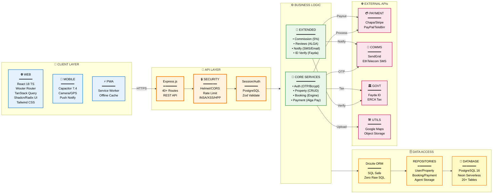

# System Architecture Diagram (Part 2/3)
## Component Architecture - Service & Module Breakdown



## Service-to-Service Communication

### **Internal Communication (Within Application):**

**1. Client ↔ API Layer:**
- **Protocol:** HTTP/HTTPS (RESTful JSON)
- **Authentication:** Session cookies (httpOnly, secure)
- **Format:** JSON request/response
- **Error Handling:** Standardized error codes (400, 401, 403, 404, 500)

**2. API ↔ Business Logic:**
- **Type:** Direct function calls (same process)
- **Pattern:** Service-oriented architecture
- **Validation:** Zod schemas at API entry, business rules in services
- **Transaction:** Database transactions handled at service layer

**3. Business Logic ↔ Data Layer:**
- **Interface:** Drizzle ORM (TypeScript)
- **Pattern:** Repository pattern (storage interface)
- **Safety:** 100% parameterized queries (zero raw SQL)
- **Connection:** Connection pool (automatic management)

### **External Communication (Third-Party APIs):**

**Payment Processors:**
```
Alga Pay Service
    ↓ (Processor selection logic)
    ├─→ Chapa (ETB) - HTTPS POST
    ├─→ Stripe (USD/EUR) - HTTPS POST + Webhook
    ├─→ PayPal (USD) - OAuth 2.0 + HTTPS
    └─→ TeleBirr (ETB - agent payouts) - HTTPS POST
```

**Communication Services:**
```
Notification Service
    ├─→ SendGrid (Email) - HTTPS POST with API key
    └─→ Ethiopian Telecom (SMS) - HTTPS POST with credentials
```

**Government/Identity:**
```
ID Verification Service
    └─→ Fayda ID - HTTPS POST with government credentials

Payment Service
    └─→ ERCA - HTTPS GET (tax guidelines)
```

### **Middleware Flow:**

**Every API request passes through:**
```
1. HTTPS/TLS → Ensure encrypted transport
2. CORS → Validate origin
3. Helmet → Set security headers
4. Rate Limiting → Prevent abuse (100 req/15min)
5. INSA Hardening → Detect XSS, SQL injection, CSRF
6. Session Middleware → Verify authentication
7. Validation Middleware → Validate input (Zod)
8. Route Handler → Execute business logic
```

### **Key Integration Points:**

**A. Image Upload Pipeline:**
```
Client (React/Capacitor)
    ↓ (Compress image - browser-image-compression)
Client
    ↓ (POST /api/properties/upload)
Property Service
    ↓ (Validate type, size)
Property Service
    ↓ (Upload to storage)
Cloud Object Storage (Google Cloud)
    ↓ (Return public URL)
Property Service
    ↓ (Store URL in DB)
PostgreSQL
```

**B. OTP Authentication Flow:**
```
Auth Service
    ↓ (Generate 4-digit OTP)
Auth Service
    ↓ (Hash with Bcrypt)
PostgreSQL (Store hashed OTP)
    ↓
Auth Service
    ↓ (Send plain OTP via SMS)
Ethiopian Telecom SMS API
    ↓
User receives OTP
    ↓ (Submit OTP)
Auth Service
    ↓ (Verify with Bcrypt compare)
PostgreSQL (Match hash)
    ↓ (Create session)
Session Store (PostgreSQL)
```

**C. Payment Processing Flow:**
```
Booking Service
    ↓ (Calculate total)
Payment Service
    ↓ (Select processor by currency)
Payment Service
    ↓ (Create payment request)
External Payment Processor
    ↓ (Process payment)
Payment Processor
    ↓ (Webhook confirmation)
Payment Service
    ↓ (Verify signature)
Payment Service
    ↓ (Update booking status)
Booking Service
    ↓ (Notify host)
Notification Service
```

### **Module Dependencies:**

**Core Dependencies (85+ npm packages):**
- **Web Framework:** express, cors, helmet
- **Database:** drizzle-orm, @neondatabase/serverless
- **Validation:** zod, drizzle-zod, express-validator
- **Security:** bcrypt, xss-clean, express-rate-limit, hpp
- **Payments:** chapa-nodejs, stripe, @paypal/paypal-server-sdk
- **File Handling:** multer, sharp, browser-image-compression
- **Mobile:** @capacitor/core, @capacitor/android, @capacitor/ios

**No Deprecated Dependencies:** All packages actively maintained (as of Nov 2025)

---

**Document:** Component Architecture  
**Created:** November 6, 2025  
**Standard:** INSA System Architecture Requirements  
**Export:** Use mermaid.live to export to PNG/PDF
