# System Architecture Diagram (Part 2/3)
## Component Architecture - Service & Module Breakdown

```mermaid
flowchart LR
    %% Left Column - Client Layer
    subgraph Client["📱 CLIENT LAYER"]
        direction TB
        Web["🌐 WEB<br/>━━━━━━━<br/>React 18 TS<br/>Wouter Router<br/>TanStack Query<br/>Shadcn/Radix UI<br/>Tailwind CSS"]
        Mobile["📱 MOBILE<br/>━━━━━━━<br/>Capacitor 7.4<br/>Camera/GPS<br/>Push Notify"]
        PWA["⚡ PWA<br/>━━━━━━━<br/>Service Worker<br/>Offline Cache"]
    end
    
    %% Middle Top - API & Security
    subgraph API["🔌 API LAYER"]
        direction TB
        Express["Express.js<br/>━━━━━━━<br/>40+ Routes<br/>REST API"]
        Security["🔒 SECURITY<br/>━━━━━━━<br/>Helmet/CORS<br/>Rate Limit<br/>INSA/XSS/HPP"]
        Session["Session/Auth<br/>━━━━━━━<br/>PostgreSQL<br/>Zod Validate"]
    end
    
    %% Middle Bottom - Business Logic
    subgraph Business["⚙️ BUSINESS LOGIC"]
        direction TB
        Core["🎯 CORE SERVICES<br/>━━━━━━━━━━<br/>• Auth (OTP/Bcrypt)<br/>• Property (CRUD)<br/>• Booking (Engine)<br/>• Payment (Alga Pay)"]
        Extended["🔧 EXTENDED<br/>━━━━━━━━━━<br/>• Commission (5%)<br/>• Reviews (ALGA)<br/>• Notify (SMS/Email)<br/>• ID Verify (Fayda)"]
    end
    
    %% Right Top - Data Layer
    subgraph Data["🗄️ DATA ACCESS"]
        direction TB
        ORM["Drizzle ORM<br/>━━━━━━━<br/>SQL Safe<br/>Zero Raw SQL"]
        Repo["REPOSITORIES<br/>━━━━━━━<br/>User/Property<br/>Booking/Payment<br/>Agent Storage"]
        DB["💾 DATABASE<br/>━━━━━━━<br/>PostgreSQL 16<br/>Neon Serverless<br/>20+ Tables"]
    end
    
    %% Right Bottom - External Services
    subgraph External["🌐 EXTERNAL APIs"]
        direction TB
        Payment["💳 PAYMENT<br/>━━━━━━━<br/>Chapa/Stripe<br/>PayPal/TeleBirr"]
        Comm["📧 COMMS<br/>━━━━━━━<br/>SendGrid<br/>EthTelecom SMS"]
        Gov["🏛️ GOVT<br/>━━━━━━━<br/>Fayda ID<br/>ERCA Tax"]
        Utils["🛠️ UTILS<br/>━━━━━━━<br/>Google Maps<br/>Object Storage"]
    end
    
    %% Flows - Left to Right
    Client -->|HTTPS| Express
    Express --> Security
    Security --> Session
    Session --> Business
    
    Business --> ORM
    ORM --> Repo
    Repo --> DB
    
    Core -->|OTP| Comm
    Core -->|Upload| Utils
    Core -->|Process| Payment
    Extended -->|Payout| Payment
    Extended -->|Notify| Comm
    Extended -->|Verify| Gov
    Core -->|Tax| Gov
    
    %% Styling - Compact for A4
    classDef clientClass fill:#e3f2fd,stroke:#1976d2,stroke-width:2px,color:#000
    classDef apiClass fill:#fff3e0,stroke:#f57c00,stroke-width:3px,color:#000
    classDef businessClass fill:#e8f5e9,stroke:#388e3c,stroke-width:2px,color:#000
    classDef dataClass fill:#fff9c4,stroke:#f57f17,stroke-width:2px,color:#000
    classDef externalClass fill:#fce4ec,stroke:#c2185b,stroke-width:2px,color:#000
    
    class Web,Mobile,PWA clientClass
    class Express,Security,Session apiClass
    class Core,Extended businessClass
    class ORM,Repo,DB dataClass
    class Payment,Comm,Gov,Utils externalClass
```



## Service-to-Service Communication

### **Internal Communication (Within Application):**

**1. Client ↔ API Layer:**
- **Protocol:** HTTP/HTTPS (RESTful JSON)
- **Authentication:** Session cookies (httpOnly, secure)
- **Format:** JSON request/response
- **Error Handling:** Standardized error codes (400, 401, 403, 404, 500)

**2. API ↔ Business Logic:**
- **Type:** Direct function calls (same process)
- **Pattern:** Service-oriented architecture
- **Validation:** Zod schemas at API entry, business rules in services
- **Transaction:** Database transactions handled at service layer

**3. Business Logic ↔ Data Layer:**
- **Interface:** Drizzle ORM (TypeScript)
- **Pattern:** Repository pattern (storage interface)
- **Safety:** 100% parameterized queries (zero raw SQL)
- **Connection:** Connection pool (automatic management)

### **External Communication (Third-Party APIs):**

**Payment Processors:**
```
Alga Pay Service
    ↓ (Processor selection logic)
    ├─→ Chapa (ETB) - HTTPS POST
    ├─→ Stripe (USD/EUR) - HTTPS POST + Webhook
    ├─→ PayPal (USD) - OAuth 2.0 + HTTPS
    └─→ TeleBirr (ETB - agent payouts) - HTTPS POST
```

**Communication Services:**
```
Notification Service
    ├─→ SendGrid (Email) - HTTPS POST with API key
    └─→ Ethiopian Telecom (SMS) - HTTPS POST with credentials
```

**Government/Identity:**
```
ID Verification Service
    └─→ Fayda ID - HTTPS POST with government credentials

Payment Service
    └─→ ERCA - HTTPS GET (tax guidelines)
```

### **Middleware Flow:**

**Every API request passes through:**
```
1. HTTPS/TLS → Ensure encrypted transport
2. CORS → Validate origin
3. Helmet → Set security headers
4. Rate Limiting → Prevent abuse (100 req/15min)
5. INSA Hardening → Detect XSS, SQL injection, CSRF
6. Session Middleware → Verify authentication
7. Validation Middleware → Validate input (Zod)
8. Route Handler → Execute business logic
```

### **Key Integration Points:**

**A. Image Upload Pipeline:**
```
Client (React/Capacitor)
    ↓ (Compress image - browser-image-compression)
Client
    ↓ (POST /api/properties/upload)
Property Service
    ↓ (Validate type, size)
Property Service
    ↓ (Upload to storage)
Cloud Object Storage (Google Cloud)
    ↓ (Return public URL)
Property Service
    ↓ (Store URL in DB)
PostgreSQL
```

**B. OTP Authentication Flow:**
```
Auth Service
    ↓ (Generate 4-digit OTP)
Auth Service
    ↓ (Hash with Bcrypt)
PostgreSQL (Store hashed OTP)
    ↓
Auth Service
    ↓ (Send plain OTP via SMS)
Ethiopian Telecom SMS API
    ↓
User receives OTP
    ↓ (Submit OTP)
Auth Service
    ↓ (Verify with Bcrypt compare)
PostgreSQL (Match hash)
    ↓ (Create session)
Session Store (PostgreSQL)
```

**C. Payment Processing Flow:**
```
Booking Service
    ↓ (Calculate total)
Payment Service
    ↓ (Select processor by currency)
Payment Service
    ↓ (Create payment request)
External Payment Processor
    ↓ (Process payment)
Payment Processor
    ↓ (Webhook confirmation)
Payment Service
    ↓ (Verify signature)
Payment Service
    ↓ (Update booking status)
Booking Service
    ↓ (Notify host)
Notification Service
```

### **Module Dependencies:**

**Core Dependencies (85+ npm packages):**
- **Web Framework:** express, cors, helmet
- **Database:** drizzle-orm, @neondatabase/serverless
- **Validation:** zod, drizzle-zod, express-validator
- **Security:** bcrypt, xss-clean, express-rate-limit, hpp
- **Payments:** chapa-nodejs, stripe, @paypal/paypal-server-sdk
- **File Handling:** multer, sharp, browser-image-compression
- **Mobile:** @capacitor/core, @capacitor/android, @capacitor/ios

**No Deprecated Dependencies:** All packages actively maintained (as of Nov 2025)

---

**Document:** Component Architecture  
**Created:** November 6, 2025  
**Standard:** INSA System Architecture Requirements  
**Export:** Use mermaid.live to export to PNG/PDF
