# Data Flow Diagram (DFD) - Context Level 0
## Alga Platform - External View

**Purpose:** Shows Alga as a single system boundary with all external actors (Guest, Host, Agent, Operator, Admin) and external systems (payment processors, communication services, government APIs). Illustrates what data flows into and out of the platform from an external perspective.

**For INSA Audit:** Identifies all entry points for potential security threats, external data sources, and third-party dependencies requiring security assessment. Essential for attack surface analysis.

```mermaid
flowchart TB
    %% External Entities
    Guest["👤 Guest<br/>(Property Renter)"]
    Host["🏠 Host<br/>(Property Owner)"]
    Agent["🤝 Delala Agent<br/>(Property Agent)"]
    Operator["👮 Operator<br/>(ID Verification)"]
    Admin["⚙️ Administrator<br/>(Platform Admin)"]
    
    %% External Systems
    Chapa["💳 Chapa<br/>(Ethiopian Payments)"]
    Stripe["💳 Stripe<br/>(International Cards)"]
    PayPal["💳 PayPal<br/>(International)"]
    TeleBirr["📱 TeleBirr<br/>(Agent Payouts)"]
    SendGrid["✉️ SendGrid<br/>(Email)"]
    EthTelecom["📞 Ethiopian Telecom<br/>(SMS)"]
    GoogleMaps["🗺️ Google Maps<br/>(Geocoding)"]
    FaydaID["🆔 Fayda ID<br/>(eKYC)"]
    ERCA["🏛️ ERCA<br/>(Tax Authority)"]
    
    %% Central System
    Alga[("🛏️ ALGA PLATFORM<br/>Property Rental System")]
    
    %% Guest Flows
    Guest -->|"Search Properties<br/>Booking Request<br/>Payment Info"| Alga
    Alga -->|"Available Properties<br/>Booking Confirmation<br/>Access Code"| Guest
    
    %% Host Flows
    Host -->|"Property Listings<br/>Photos<br/>Pricing"| Alga
    Alga -->|"Booking Notifications<br/>100% Payment<br/>Analytics"| Host
    
    %% Agent Flows
    Agent -->|"Registration<br/>Property Links<br/>TeleBirr Account"| Alga
    Alga -->|"Commission Dashboard<br/>Earnings Report"| Agent
    
    %% Operator Flows
    Operator -->|"ID Verification<br/>Approval/Rejection"| Alga
    Alga -->|"Pending Verifications<br/>Document Queue"| Operator
    
    %% Admin Flows
    Admin -->|"User Management<br/>System Config<br/>Agent Approval"| Alga
    Alga -->|"Platform Statistics<br/>Reports<br/>Audit Logs"| Admin
    
    %% Payment Processor Flows
    Alga -->|"Payment Request<br/>(Guest → Host)"| Chapa
    Chapa -->|"Payment Confirmation<br/>Transaction ID"| Alga
    
    Alga -->|"Card Payment Request"| Stripe
    Stripe -->|"Payment Status"| Alga
    
    Alga -->|"PayPal Payment"| PayPal
    PayPal -->|"Payment Confirmation"| Alga
    
    Alga -->|"5% Commission Payout<br/>(Agent Earnings)"| TeleBirr
    TeleBirr -->|"Payout Confirmation"| Alga
    
    %% Communication Flows
    Alga -->|"OTP Codes<br/>Notifications"| SendGrid
    SendGrid -->|"Email Delivery Status"| Alga
    
    Alga -->|"4-Digit OTP SMS"| EthTelecom
    EthTelecom -->|"SMS Status"| Alga
    
    %% Location & Identity Flows
    Alga -->|"Address Query"| GoogleMaps
    GoogleMaps -->|"Coordinates<br/>Location Data"| Alga
    
    Alga -->|"ID Verification Request"| FaydaID
    FaydaID -->|"eKYC Response<br/>Citizen Data"| Alga
    
    %% Tax Compliance Flow
    Alga -->|"Tax Calculations<br/>Invoice Data"| ERCA
    ERCA -->|"Tax Guidelines<br/>Compliance Rules"| Alga
    
    %% Styling
    classDef userClass fill:#e1f5ff,stroke:#0288d1,stroke-width:2px
    classDef systemClass fill:#fff3e0,stroke:#f57c00,stroke-width:2px
    classDef paymentClass fill:#e8f5e9,stroke:#388e3c,stroke-width:2px
    classDef commClass fill:#f3e5f5,stroke:#7b1fa2,stroke-width:2px
    classDef coreClass fill:#ffebee,stroke:#c62828,stroke-width:3px
    
    class Guest,Host,Agent,Operator,Admin userClass
    class GoogleMaps,FaydaID,ERCA systemClass
    class Chapa,Stripe,PayPal,TeleBirr paymentClass
    class SendGrid,EthTelecom commClass
    class Alga coreClass
```

## System Boundary

**Trust Boundary:** Alga Platform (Red Border)

**External Entities:**
- 5 User Roles (Guests, Hosts, Agents, Operators, Admins)
- 4 Payment Processors
- 2 Communication Services
- 3 Government/Identity Systems

**Primary Data Flows:**
1. **Guest → Alga:** Search, Book, Pay
2. **Host → Alga:** List Properties, Receive 100% Payment
3. **Agent → Alga:** Register, Link Properties, Track 5% Commission
4. **Alga → Payment Processors:** Process Transactions
5. **Alga → TeleBirr:** Distribute Agent Commissions (Separate from Host Payment)
6. **Alga ↔ Communication:** Send OTP, Notifications
7. **Alga ↔ Government Systems:** Tax Compliance, Identity Verification

## Critical Security Notes

- **All communications encrypted via HTTPS/TLS**
- **No raw SQL** - All database access via Drizzle ORM
- **Multi-layer validation** - Frontend (Zod) + Backend (express-validator)
- **Session storage** - PostgreSQL (not in-memory)
- **INSA hardening** - XSS, SQL injection, CSRF, HPP protection active

---

**Document:** DFD Context Level 0  
**Created:** November 6, 2025  
**Standard:** INSA OF/AEAD/001  
**Tool:** Mermaid.js (Export to PNG/SVG via GitHub, VS Code, or mermaid.live)
