# Data Flow Diagram (DFD) - Detailed Level 1
## Alga Platform - Internal Processes

```mermaid
flowchart TB
    %% External Entities
    Guest["👤 Guest"]
    Host["🏠 Host"]
    Agent["🤝 Agent"]
    PaymentGW["💳 Payment Gateway<br/>(Chapa/Stripe/PayPal)"]
    TeleBirr["📱 TeleBirr"]
    SMS["📞 SMS Service"]
    
    %% Data Stores
    DB1[("D1: Users<br/>Database")]
    DB2[("D2: Properties<br/>Database")]
    DB3[("D3: Bookings<br/>Database")]
    DB4[("D4: Payments<br/>Database")]
    DB5[("D5: Agents<br/>Database")]
    DB6[("D6: Commissions<br/>Database")]
    DB7[("D7: Sessions<br/>Database")]
    
    %% Process 1: Authentication
    P1["Process 1.0<br/>🔐 AUTHENTICATION<br/>Request OTP<br/>Verify OTP<br/>Create Session"]
    
    %% Process 2: Property Management
    P2["Process 2.0<br/>🏠 PROPERTY MGMT<br/>Create Listing<br/>Upload Images<br/>Set Pricing"]
    
    %% Process 3: Search & Discovery
    P3["Process 3.0<br/>🔍 SEARCH ENGINE<br/>Filter Properties<br/>Calculate Distance<br/>Sort Results"]
    
    %% Process 4: Booking System
    P4["Process 4.0<br/>📅 BOOKING SYSTEM<br/>Check Availability<br/>Reserve Dates<br/>Generate Access Code"]
    
    %% Process 5: Payment Processing
    P5["Process 5.0<br/>💰 ALGA PAY<br/>Calculate Commission<br/>Process Payment<br/>Distribute Funds"]
    
    %% Process 6: Commission Tracking
    P6["Process 6.0<br/>💵 COMMISSION ENGINE<br/>Calculate 5%<br/>Track 36 Months<br/>Queue Payout"]
    
    %% Process 7: Payout Distribution
    P7["Process 7.0<br/>💸 PAYOUT PROCESSOR<br/>Validate TeleBirr<br/>Transfer Commission<br/>Record Transaction"]
    
    %% Authentication Flow (Process 1)
    Guest -->|"Phone/Email"| P1
    Host -->|"Phone/Email"| P1
    Agent -->|"Phone/Email"| P1
    P1 -->|"Generate OTP"| SMS
    SMS -->|"4-Digit Code"| Guest
    SMS -->|"4-Digit Code"| Host
    SMS -->|"4-Digit Code"| Agent
    P1 <-->|"Store/Verify<br/>OTP & Session"| DB1
    P1 <-->|"Session Data"| DB7
    
    %% Property Management Flow (Process 2)
    Host -->|"Property Details<br/>Images, Pricing"| P2
    P2 -->|"Store Property"| DB2
    P2 -->|"Link to Host"| DB1
    
    %% Search Flow (Process 3)
    Guest -->|"Search Criteria<br/>(City, Dates, Price)"| P3
    P3 <-->|"Query Properties"| DB2
    P3 -->|"Search Results"| Guest
    
    %% Booking Flow (Process 4)
    Guest -->|"Booking Request<br/>(Dates, Guests)"| P4
    P4 <-->|"Check Conflicts"| DB3
    P4 <-->|"Verify Property"| DB2
    P4 -->|"Create Booking"| DB3
    P4 -->|"Generate 6-Digit<br/>Access Code"| DB3
    
    %% Payment Flow (Process 5)
    P4 -->|"Booking Total"| P5
    P5 -->|"Payment Request"| PaymentGW
    PaymentGW -->|"Confirmation"| P5
    P5 -->|"Record Transaction"| DB4
    P5 -->|"Calculate:<br/>12% Service Fee<br/>15% VAT<br/>2% Withholding"| DB4
    P5 -->|"100% to Host"| DB4
    P5 -->|"Update Status"| DB3
    
    %% Commission Calculation (Process 6)
    P5 -->|"Booking Amount"| P6
    P6 <-->|"Check Agent Link"| DB5
    P6 -->|"Calculate 5%"| P6
    P6 -->|"Check Expiry<br/>(36 months)"| P6
    P6 -->|"Store Commission"| DB6
    P6 <-->|"Update Earnings"| DB5
    
    %% Payout Flow (Process 7)
    P6 -->|"Commission Due"| P7
    P7 <-->|"Get TeleBirr Account"| DB5
    P7 -->|"Payout Request"| TeleBirr
    TeleBirr -->|"Confirmation"| P7
    P7 -->|"Mark as Paid"| DB6
    Agent <-->|"View Dashboard"| DB5
    Agent <-->|"Earnings History"| DB6
    
    %% Host Notifications
    P4 -->|"Booking Alert"| Host
    P5 -->|"Payment Received"| Host
    
    %% Guest Confirmation
    P4 -->|"Access Code"| Guest
    P5 -->|"Receipt"| Guest
    
    %% Styling
    classDef processClass fill:#e3f2fd,stroke:#1976d2,stroke-width:2px
    classDef datastoreClass fill:#fff9c4,stroke:#f57f17,stroke-width:2px
    classDef externalClass fill:#f3e5f5,stroke:#7b1fa2,stroke-width:2px
    
    class P1,P2,P3,P4,P5,P6,P7 processClass
    class DB1,DB2,DB3,DB4,DB5,DB6,DB7 datastoreClass
    class Guest,Host,Agent,PaymentGW,TeleBirr,SMS externalClass
```

## Process Descriptions

### Process 1.0 - Authentication
**Function:** Passwordless OTP authentication
- **Input:** Phone/Email from user
- **Process:** 
  1. Generate 4-digit OTP
  2. Send via SMS (Ethiopian Telecom)
  3. Verify code within 10 minutes
  4. Create session in PostgreSQL
- **Output:** Session token (httpOnly cookie)
- **Security:** Bcrypt hashing, rate limiting (5 OTP/hour)

### Process 2.0 - Property Management
**Function:** Host creates and manages property listings
- **Input:** Property details, images (max 10), pricing
- **Process:**
  1. Validate input (Zod schema)
  2. Compress images (browser-image-compression)
  3. Upload to Replit Object Storage
  4. Generate 6-digit access code
  5. Set status = 'pending' (admin approval)
- **Output:** Property ID, pending verification
- **Security:** File type validation, size limits (5MB)

### Process 3.0 - Search Engine
**Function:** Guest searches available properties
- **Input:** City, dates, price range, guests
- **Process:**
  1. Query properties by filters
  2. Check availability (no booking conflicts)
  3. Calculate distance (Google Maps API)
  4. Sort by relevance/price/rating
- **Output:** Filtered property list
- **Performance:** <500ms response time

### Process 4.0 - Booking System
**Function:** Create reservation with conflict prevention
- **Input:** Property ID, check-in, check-out, guests
- **Process:**
  1. Verify property active
  2. Check date availability (no overlaps)
  3. Validate guest capacity
  4. Generate unique 6-digit access code
  5. Reserve dates (status = 'pending')
- **Output:** Booking ID, access code
- **Security:** Date validation, SQL injection prevention (Drizzle ORM)

### Process 5.0 - Alga Pay (Payment Processing)
**Function:** White-labeled payment gateway with commission calculation
- **Input:** Booking ID, payment method selection
- **Process:**
  1. Calculate total: property price × nights
  2. Calculate Alga commission: 12% of total
  3. Calculate VAT: 15% of commission
  4. Calculate withholding tax: 2% of total
  5. Route to processor (Chapa/Stripe/PayPal)
  6. Wait for confirmation
  7. **Transfer 100% of booking amount to Host**
  8. **Platform retains 12% service fee**
  9. Update booking status = 'confirmed'
  10. Generate ERCA-compliant PDF invoice
- **Output:** Transaction ID, invoice, payment confirmation
- **Security:** PCI DSS compliance (processor-handled), encrypted storage

### Process 6.0 - Commission Engine
**Function:** Calculate and track Delala Agent commissions
- **Input:** Confirmed booking, booking amount
- **Process:**
  1. Check if property has agent link (DB5: agent_properties)
  2. Verify link not expired (< 36 months since link date)
  3. Calculate commission: 5% of booking total
  4. Create commission record (status = 'pending')
  5. Update agent total_earnings
  6. **Note:** Commission paid SEPARATELY from 12% service fee
- **Output:** Commission record
- **Business Rule:** Agent earns 5% for 36 months from property link

### Process 7.0 - Payout Processor
**Function:** Distribute agent commissions via TeleBirr
- **Input:** Pending commission records
- **Process:**
  1. Retrieve agent's TeleBirr account number
  2. Batch commissions (weekly/monthly)
  3. Initiate TeleBirr API transfer
  4. Validate transaction
  5. Mark commission as 'paid'
  6. Log payout timestamp
- **Output:** TeleBirr transaction ID, paid confirmation
- **Security:** TeleBirr account verification, transaction logging

## Data Store Details

| Store | Description | Sensitive Fields | Access Control |
|-------|-------------|------------------|----------------|
| D1: Users | User accounts, roles, OTP | Password hash, phone, OTP, Fayda ID | Role-based (Admin full access) |
| D2: Properties | Listings, images, pricing | Latitude, longitude, access codes | Host owns, Guest reads |
| D3: Bookings | Reservations, status | Access codes, guest info | Guest/Host only |
| D4: Payments | Transactions, invoices | All financial data | Encrypted, Admin/Host only |
| D5: Agents | Agent profiles, TeleBirr | TeleBirr account, earnings | Agent/Admin only |
| D6: Commissions | Commission records | Commission amounts | Agent/Admin only |
| D7: Sessions | Active sessions | Session data | System only |

## Critical Business Rules

1. **Payment Split:**
   - Guest pays 100% of booking amount
   - Host receives 100% of booking amount
   - Platform retains 12% service fee (from separate calculations)
   - Agent receives 5% commission (paid from platform's 12% fee via TeleBirr)

2. **Commission Duration:**
   - Agent earns 5% for 36 months from property link date
   - After 36 months, commission automatically expires
   - Agent can link unlimited properties

3. **Access Codes:**
   - Unique 6-digit code per booking
   - Shared with guest after payment confirmation
   - Valid only for booking dates

4. **Tax Compliance:**
   - 15% VAT on platform commission
   - 2% withholding tax on host earnings
   - ERCA-compliant invoices (jsPDF generation)

---

**Document:** DFD Detailed Level 1  
**Created:** November 6, 2025  
**Standard:** INSA OF/AEAD/001  
**Export:** Use mermaid.live, GitHub, or VS Code to export to PNG/SVG
