# System Architecture Diagram (Part 1/3)
## Deployment Architecture - Cloud Infrastructure

```mermaid
flowchart TB
    %% Internet Layer
    subgraph Internet["🌐 INTERNET"]
        Users["👥 Users<br/>(Web & Mobile)"]
        DNS["🔍 DNS<br/>alga.et"]
    end
    
    %% Edge/CDN Layer
    subgraph Edge["⚡ EDGE LAYER"]
        CloudFlare["☁️ CloudFlare<br/>(Optional CDN)"]
        LoadBalancer["⚖️ Load Balancer<br/>(Auto-Scaling)"]
    end
    
    %% Application Layer (Replit Infrastructure)
    subgraph ReplitCloud["☁️ REPLIT CLOUD (US-CENTRAL)"]
        direction TB
        
        subgraph AppServers["🖥️ APPLICATION SERVERS (Auto-Scaling)"]
            direction LR
            WebServer1["Web Server 1<br/>Node.js + Express<br/>Port 5000"]
            WebServer2["Web Server 2<br/>Node.js + Express<br/>Port 5000"]
            WebServer3["Web Server N<br/>(Auto-Scale)<br/>Port 5000"]
        end
        
        subgraph StaticAssets["📦 STATIC ASSETS"]
            Vite["Vite Build<br/>(React Bundle)<br/>dist/public/"]
            Images["Property Images<br/>(Compressed)"]
        end
    end
    
    %% Database Layer (Neon Serverless)
    subgraph DatabaseTier["🗄️ DATABASE TIER (AWS US-EAST)"]
        direction TB
        
        subgraph NeonCluster["Neon Serverless PostgreSQL"]
            PrimaryDB["Primary DB<br/>PostgreSQL 16<br/>(Read/Write)"]
            ReplicaDB["Replica DB<br/>(Read-Only)<br/>Auto-Failover"]
        end
        
        ConnectionPool["Connection Pool<br/>(Serverless)<br/>Auto-Scaling"]
        
        PrimaryDB <-->|"Replication"| ReplicaDB
        ConnectionPool -->|"Route Queries"| PrimaryDB
        ConnectionPool -->|"Read Queries"| ReplicaDB
    end
    
    %% Object Storage
    subgraph Storage["💾 OBJECT STORAGE"]
        GCS["Google Cloud Storage<br/>(Replit App Storage)<br/>Images, Documents, PDFs"]
    end
    
    %% Session Store
    subgraph SessionStore["🔐 SESSION MANAGEMENT"]
        PGSession["PostgreSQL Session Store<br/>(connect-pg-simple)<br/>24hr TTL"]
    end
    
    %% External Services
    subgraph ExternalServices["🌐 EXTERNAL SERVICES (Third-Party)"]
        direction TB
        
        subgraph Payments["💳 PAYMENT PROCESSORS"]
            Chapa["Chapa API<br/>(Ethiopian)"]
            Stripe["Stripe API<br/>(International)"]
            PayPal["PayPal API<br/>(International)"]
            TeleBirr["TeleBirr API<br/>(Agent Payouts)"]
        end
        
        subgraph Communications["📧 COMMUNICATIONS"]
            SendGrid["SendGrid<br/>(Email)"]
            EthTelecom["Ethiopian Telecom<br/>(SMS OTP)"]
        end
        
        subgraph Government["🏛️ GOVERNMENT APIS"]
            FaydaID["Fayda ID<br/>(eKYC)"]
            ERCA["ERCA<br/>(Tax)"]
        end
        
        subgraph LocationServices["🗺️ LOCATION"]
            GoogleMaps["Google Maps<br/>Geocoding API"]
        end
    end
    
    %% Monitoring & Logging
    subgraph Observability["📊 MONITORING & LOGGING"]
        ReplitLogs["Replit Logs<br/>(Workflow Output)"]
        DBMetrics["Neon Metrics<br/>(DB Performance)"]
        ErrorTracking["Error Logs<br/>(PostgreSQL)"]
    end
    
    %% Flow Connections
    Users -->|"HTTPS"| DNS
    DNS -->|"Resolve"| CloudFlare
    CloudFlare -->|"TLS 1.2+"| LoadBalancer
    LoadBalancer -->|"Distribute"| AppServers
    
    WebServer1 & WebServer2 & WebServer3 -->|"Serve"| StaticAssets
    WebServer1 & WebServer2 & WebServer3 <-->|"SQL Queries"| ConnectionPool
    WebServer1 & WebServer2 & WebServer3 <-->|"Sessions"| PGSession
    WebServer1 & WebServer2 & WebServer3 <-->|"Upload/Retrieve"| GCS
    
    PGSession -->|"Store in"| PrimaryDB
    
    WebServer1 & WebServer2 & WebServer3 -->|"HTTPS API"| ExternalServices
    
    AppServers -.->|"Logs"| ReplitLogs
    NeonCluster -.->|"Metrics"| DBMetrics
    AppServers -.->|"Errors"| ErrorTracking
    
    %% Styling
    classDef internetClass fill:#e3f2fd,stroke:#1976d2,stroke-width:2px
    classDef edgeClass fill:#fff3e0,stroke:#f57c00,stroke-width:2px
    classDef appClass fill:#e8f5e9,stroke:#388e3c,stroke-width:3px
    classDef dbClass fill:#fff9c4,stroke:#f57f17,stroke-width:3px
    classDef storageClass fill:#f3e5f5,stroke:#7b1fa2,stroke-width:2px
    classDef externalClass fill:#fce4ec,stroke:#c2185b,stroke-width:2px
    classDef monitorClass fill:#e0f2f1,stroke:#00796b,stroke-width:2px
    
    class Users,DNS internetClass
    class CloudFlare,LoadBalancer edgeClass
    class WebServer1,WebServer2,WebServer3,Vite,Images appClass
    class PrimaryDB,ReplicaDB,ConnectionPool,PGSession dbClass
    class GCS storageClass
    class Chapa,Stripe,PayPal,TeleBirr,SendGrid,EthTelecom,FaydaID,ERCA,GoogleMaps externalClass
    class ReplitLogs,DBMetrics,ErrorTracking monitorClass
```



## Deployment Details

### **Infrastructure Type:** Cloud-Based (Serverless)

**Primary Provider:** Replit (US-Central region)  
**Database Provider:** Neon (AWS US-East region)  
**Storage Provider:** Google Cloud Storage (via Replit)

### **Geographic Distribution:**
- **Application Servers:** US-Central (Replit infrastructure)
- **Database:** AWS US-East (Neon serverless PostgreSQL)
- **CDN:** CloudFlare (optional, global edge locations)
- **End Users:** Ethiopia (Addis Ababa, Bahir Dar, Gondar, etc.)

### **Latency Considerations:**
- **US ↔ Ethiopia:** ~180-250ms (acceptable for web applications)
- **Database replication:** <5ms (within AWS region)
- **CDN edge caching:** Reduces static asset load time by 60-80%

### **Auto-Scaling:**
- **Application Tier:** Replit auto-scales based on load (0-N instances)
- **Database Tier:** Neon serverless auto-scales connection pool
- **Storage Tier:** Google Cloud Storage (unlimited capacity)

### **High Availability:**
- **Application:** Multi-instance deployment with load balancing
- **Database:** Primary + Replica with automatic failover (<30s)
- **Session Store:** PostgreSQL (persisted, survives restarts)

### **Backup & Recovery:**
- **Database Backups:** Daily automated (Neon), 30-day retention
- **Point-in-Time Recovery:** Available (Neon feature)
- **Object Storage:** Versioned (Google Cloud Storage)

### **Network Architecture:**
```
Internet (Ethiopia)
    ↓ (HTTPS/TLS 1.2+)
CloudFlare CDN (Optional)
    ↓ (TLS)
Replit Load Balancer
    ↓ (Internal routing)
Application Servers (Auto-scaling pool)
    ↓ (TLS connection)
Neon Database (Serverless PostgreSQL)
```

### **Port Configuration:**
- **Public Port:** 443 (HTTPS only, HTTP redirects to HTTPS)
- **Application Port:** 5000 (internal, behind Replit reverse proxy)
- **Database Port:** 5432 (PostgreSQL, TLS encrypted)

### **Data Residency:**
- **User Data:** Stored in Neon (AWS US-East)
- **File Uploads:** Google Cloud Storage (multi-region)
- **Session Data:** PostgreSQL (co-located with main database)
- **Logs:** Replit infrastructure (US-Central)

**Note:** All data encrypted at-rest (AES-256) and in-transit (TLS 1.2+)

---

**Document:** Deployment Architecture  
**Created:** November 6, 2025  
**Standard:** INSA System Architecture Requirements  
**Export:** Use mermaid.live to export to PNG/PDF
