# System Architecture Diagram (Part 1/3)
## Deployment Architecture - Cloud Infrastructure

```mermaid
flowchart LR
    %% Left Side - Users & Edge
    subgraph Client["🌐 CLIENT LAYER"]
        Users["👥 Users<br/>Web/Mobile"]
        DNS["DNS<br/>alga.et"]
    end
    
    subgraph Edge["⚡ EDGE"]
        CDN["CDN<br/>CloudFlare"]
        LB["Load<br/>Balancer"]
    end
    
    %% Center - Application Servers
    subgraph CloudPlatform["☁️ APPLICATION CLOUD PLATFORM US-CENTRAL"]
        direction TB
        App["🖥️ APP SERVERS<br/>━━━━━━━━━━━<br/>Node.js Express<br/>Port 5000<br/>Auto-Scale 1-N"]
        Static["📦 ASSETS<br/>━━━━━━━━━<br/>Vite/React<br/>Images"]
    end
    
    %% Right - Database & Storage
    subgraph Data["🗄️ DATA TIER AWS US-EAST"]
        direction TB
        DB["PostgreSQL 16<br/>━━━━━━━━━<br/>Primary + Replica<br/>Auto-Failover"]
        Pool["Connection Pool<br/>Serverless"]
        Session["Sessions<br/>24hr TTL"]
    end
    
    subgraph Storage["💾 STORAGE"]
        GCS["Google Cloud<br/>━━━━━━━━<br/>Images/Docs/PDF"]
    end
    
    %% Bottom - External Services (Compact)
    subgraph External["🌐 EXTERNAL SERVICES"]
        direction LR
        Pay["💳 PAYMENT<br/>Chapa/Stripe<br/>PayPal/TeleBirr"]
        Comm["📧 COMMS<br/>SendGrid<br/>EthTelecom"]
        Gov["🏛️ GOVT<br/>Fayda/ERCA"]
        Maps["🗺️ MAPS<br/>Google"]
    end
    
    %% Monitoring
    Logs["📊 LOGS & METRICS<br/>Application/Neon/Error"]
    
    %% Connections - Left to Right Flow
    Users -->|HTTPS| DNS
    DNS --> CDN
    CDN -->|TLS 1.2+| LB
    LB --> App
    
    App <-->|SQL| Pool
    Pool <--> DB
    App <--> Session
    Session --> DB
    App <--> Static
    App <-->|Upload| GCS
    
    App -->|API| External
    
    App -.->|Monitor| Logs
    DB -.->|Metrics| Logs
    
    %% Styling - Compact for A4
    classDef clientClass fill:#e3f2fd,stroke:#1976d2,stroke-width:2px,color:#000
    classDef edgeClass fill:#fff3e0,stroke:#f57c00,stroke-width:2px,color:#000
    classDef appClass fill:#e8f5e9,stroke:#388e3c,stroke-width:3px,color:#000
    classDef dataClass fill:#fff9c4,stroke:#f57f17,stroke-width:3px,color:#000
    classDef storageClass fill:#f3e5f5,stroke:#7b1fa2,stroke-width:2px,color:#000
    classDef externalClass fill:#fce4ec,stroke:#c2185b,stroke-width:2px,color:#000
    classDef monitorClass fill:#e0f2f1,stroke:#00796b,stroke-width:2px,color:#000
    
    class Users,DNS clientClass
    class CDN,LB edgeClass
    class App,Static appClass
    class DB,Pool,Session dataClass
    class GCS storageClass
    class Pay,Comm,Gov,Maps externalClass
    class Logs monitorClass
```



## Deployment Details

### **Infrastructure Type:** Cloud-Based (Serverless)

**Application Platform:** Cloud Platform (US-Central region)  
**Database Provider:** Neon Serverless PostgreSQL (AWS US-East region)  
**Storage Provider:** Google Cloud Storage

### **Geographic Distribution:**
- **Application Servers:** US-Central (Cloud platform infrastructure)
- **Database:** AWS US-East (Neon serverless PostgreSQL)
- **CDN:** CloudFlare (optional, global edge locations)
- **End Users:** Ethiopia (Addis Ababa, Bahir Dar, Gondar, etc.)

### **Latency Considerations:**
- **US ↔ Ethiopia:** ~180-250ms (acceptable for web applications)
- **Database replication:** <5ms (within AWS region)
- **CDN edge caching:** Reduces static asset load time by 60-80%

### **Auto-Scaling:**
- **Application Tier:** Cloud platform auto-scales based on load (0-N instances)
- **Database Tier:** Neon serverless auto-scales connection pool
- **Storage Tier:** Google Cloud Storage (unlimited capacity)

### **High Availability:**
- **Application:** Multi-instance deployment with load balancing
- **Database:** Primary + Replica with automatic failover (<30s)
- **Session Store:** PostgreSQL (persisted, survives restarts)

### **Backup & Recovery:**
- **Database Backups:** Daily automated (Neon), 30-day retention
- **Point-in-Time Recovery:** Available (Neon feature)
- **Object Storage:** Versioned (Google Cloud Storage)

### **Network Architecture:**
```
Internet (Ethiopia)
    ↓ (HTTPS/TLS 1.2+)
CloudFlare CDN (Optional)
    ↓ (TLS)
Cloud Platform Load Balancer
    ↓ (Internal routing)
Application Servers (Auto-scaling pool)
    ↓ (TLS connection)
Neon Database (Serverless PostgreSQL)
```

### **Port Configuration:**
- **Public Port:** 443 (HTTPS only, HTTP redirects to HTTPS)
- **Application Port:** 5000 (internal, behind cloud reverse proxy)
- **Database Port:** 5432 (PostgreSQL, TLS encrypted)

### **Data Residency:**
- **User Data:** Stored in Neon (AWS US-East)
- **File Uploads:** Google Cloud Storage (multi-region)
- **Session Data:** PostgreSQL (co-located with main database)
- **Logs:** Cloud platform infrastructure (US-Central)

**Note:** All data encrypted at-rest (AES-256) and in-transit (TLS 1.2+)

---

**Document:** Deployment Architecture  
**Created:** November 6, 2025  
**Standard:** INSA System Architecture Requirements  
**Export:** Use mermaid.live to export to PNG/PDF
