# Entity Relationship Diagram (ERD)
## Alga Platform - Database Schema

**Purpose:** Complete entity-relationship diagram showing all 27 database tables organized into logical groups: User & Authentication (users, sessions, verification_documents), Property Management (properties, property_info, favorites), Booking & Payment (bookings, payments, reviews), Agent Commission (agents, agent_properties, agent_commissions), Add-On Services (services, service_bookings), Safety Features (safety_check_ins), and Administrative (admin_settings, notifications).

**For INSA Audit:** Identifies all sensitive data fields marked with 🚨 (passwords, financial data, personal information), shows encryption requirements, illustrates table relationships and foreign keys, and demonstrates data integrity controls. Essential for understanding data protection requirements and compliance with Ethiopian data protection regulations.

```mermaid
flowchart TB
    %% ========================================
    %% CORE USER & AUTHENTICATION GROUP
    %% ========================================
    
    USERS["<b>USERS</b><br/>———————————————<br/>🔑 id (PK)<br/>📧 email (UK)<br/>🔐 password 🚨BCRYPT<br/>👤 first_name<br/>👤 last_name<br/>🎭 role 🛡️RBAC<br/>🔒 phone_number (UK) 🚨<br/>✓ phone_verified<br/>✓ id_verified<br/>🔒 id_number 🚨<br/>🔒 fayda_id (UK) 🚨<br/>🔐 otp 🚨BCRYPT<br/>⏰ otp_expiry<br/>📊 status"]
    
    SESSIONS["<b>SESSIONS</b><br/>———————————————<br/>🔑 sid (PK)<br/>🔐 sess (jsonb) 🚨ENCRYPTED<br/>⏰ expire"]
    
    VERIFICATION_DOCS["<b>VERIFICATION_DOCUMENTS</b><br/>———————————————<br/>🔑 id (PK)<br/>🔗 user_id (FK)<br/>📄 document_type<br/>🔒 document_url 🚨ENCRYPTED<br/>📊 status<br/>🔗 verified_by (FK)<br/>⏰ verified_at"]
    
    EMERGENCY["<b>EMERGENCY_CONTACTS</b><br/>———————————————<br/>🔑 id (PK)<br/>🔗 user_id (FK)<br/>👤 contact_name<br/>🔒 contact_phone 🚨<br/>👥 relationship"]
    
    ACTIVITY_LOG["<b>USER_ACTIVITY_LOG</b><br/>———————————————<br/>🔑 id (PK)<br/>🔗 user_id (FK)<br/>📝 action<br/>📦 metadata (jsonb)"]
    
    %% ========================================
    %% PROPERTY MANAGEMENT GROUP
    %% ========================================
    
    PROPERTIES["<b>PROPERTIES</b><br/>———————————————<br/>🔑 id (PK)<br/>🔗 host_id (FK)<br/>📝 title<br/>📄 description<br/>🏠 type<br/>📊 status 🛡️WORKFLOW<br/>🌍 city<br/>💰 price_per_night<br/>👥 max_guests<br/>🛏️ bedrooms<br/>🔒 latitude 🚨GPS<br/>🔒 longitude 🚨GPS<br/>📷 images[] 🛡️STORAGE<br/>⭐ rating<br/>✓ is_active"]
    
    PROPERTY_INFO["<b>PROPERTY_INFO</b><br/>———————————————<br/>🔑 id (PK)<br/>🔗 property_id (FK)<br/>🔐 lockbox_code 🚨<br/>🔐 wifi_details 🚨<br/>📋 house_rules<br/>🤖 lemlem_context"]
    
    FAVORITES["<b>FAVORITES</b><br/>———————————————<br/>🔑 id (PK)<br/>🔗 user_id (FK)<br/>🔗 property_id (FK)"]
    
    %% ========================================
    %% BOOKING & PAYMENT GROUP
    %% ========================================
    
    BOOKINGS["<b>BOOKINGS</b><br/>———————————————<br/>🔑 id (PK)<br/>🔗 property_id (FK)<br/>🔗 guest_id (FK)<br/>📅 check_in<br/>📅 check_out<br/>👥 total_guests<br/>🔒 total_amount 🚨FINANCIAL<br/>📊 booking_status 🛡️WORKFLOW<br/>💳 payment_status 🛡️WORKFLOW<br/>🔐 access_code 🚨6-DIGIT"]
    
    PAYMENTS["<b>PAYMENTS</b><br/>———————————————<br/>🔑 id (PK)<br/>🔗 booking_id (FK)<br/>🔒 amount 🚨FINANCIAL<br/>💱 currency<br/>💳 payment_method<br/>🔒 transaction_id (UK) 🚨<br/>🔒 alga_commission 🚨FINANCIAL<br/>🔒 vat_amount 🚨FINANCIAL<br/>🔒 withholding_tax 🚨FINANCIAL<br/>🔒 host_payout 🚨FINANCIAL<br/>📊 status 🛡️WORKFLOW"]
    
    REVIEWS["<b>REVIEWS</b><br/>———————————————<br/>🔑 id (PK)<br/>🔗 property_id (FK)<br/>🔗 guest_id (FK)<br/>🔗 booking_id (FK) 🛡️VERIFIED<br/>⭐ rating<br/>🧹 cleanliness_rating<br/>✓ accuracy_rating<br/>📍 location_rating<br/>💬 comment"]
    
    %% ========================================
    %% AGENT COMMISSION GROUP
    %% ========================================
    
    AGENTS["<b>AGENTS</b><br/>———————————————<br/>🔑 id (PK)<br/>🔗 user_id (FK)<br/>🔒 telebirr_account 🚨PAYOUT<br/>📊 verification_status 🛡️WORKFLOW<br/>🔒 total_earnings 🚨FINANCIAL"]
    
    AGENT_PROPS["<b>AGENT_PROPERTIES</b><br/>———————————————<br/>🔑 id (PK)<br/>🔗 agent_id (FK)<br/>🔗 property_id (FK)<br/>⏰ linked_at<br/>⏰ expires_at 🛡️36-MONTHS"]
    
    AGENT_COMM["<b>AGENT_COMMISSIONS</b><br/>———————————————<br/>🔑 id (PK)<br/>🔗 agent_id (FK)<br/>🔗 booking_id (FK)<br/>🔒 commission_amount 🚨5%<br/>📊 payment_status 🛡️WORKFLOW<br/>⏰ paid_at"]
    
    %% ========================================
    %% SERVICE MARKETPLACE
    %% ========================================
    
    SERVICES["<b>SERVICES</b><br/>———————————————<br/>🔑 id (PK)<br/>🔗 provider_id (FK)<br/>🏷️ category<br/>📝 title<br/>📄 description<br/>💰 price<br/>🌍 city<br/>✓ availability"]
    
    %% ========================================
    %% RELATIONSHIPS (1-to-Many)
    %% ========================================
    
    USERS -->|"1:N"| SESSIONS
    USERS -->|"1:N"| VERIFICATION_DOCS
    USERS -->|"1:N"| EMERGENCY
    USERS -->|"1:N"| ACTIVITY_LOG
    USERS -->|"hosts<br/>1:N"| PROPERTIES
    USERS -->|"books<br/>1:N"| BOOKINGS
    USERS -->|"writes<br/>1:N"| REVIEWS
    USERS -->|"saves<br/>1:N"| FAVORITES
    USERS -->|"1:1"| AGENTS
    USERS -->|"provides<br/>1:N"| SERVICES
    
    PROPERTIES -->|"1:1"| PROPERTY_INFO
    PROPERTIES -->|"1:N"| FAVORITES
    PROPERTIES -->|"receives<br/>1:N"| BOOKINGS
    PROPERTIES -->|"has<br/>1:N"| REVIEWS
    PROPERTIES -->|"1:N"| AGENT_PROPS
    
    BOOKINGS -->|"1:1"| PAYMENTS
    BOOKINGS -->|"0:1"| REVIEWS
    BOOKINGS -->|"generates<br/>0:1"| AGENT_COMM
    
    AGENTS -->|"links<br/>1:N"| AGENT_PROPS
    AGENTS -->|"earns<br/>1:N"| AGENT_COMM
    
    %% ========================================
    %% STYLING
    %% ========================================
    
    %% ========================================
    %% LEGEND
    %% ========================================
    
    LEGEND["<b>🔐 SECURITY LEGEND</b><br/>———————————————<br/>🔑 = Primary Key<br/>🔗 = Foreign Key<br/>🚨 = SENSITIVE (Encryption Required)<br/>🔐 = BCRYPT Hashing<br/>🛡️ = Access Control Required<br/>🔒 = Encrypted at Rest (AES-256)"]
    
    %% ========================================
    %% STYLING
    %% ========================================
    
    classDef userClass fill:#e3f2fd,stroke:#1976d2,stroke-width:3px,color:#000
    classDef propertyClass fill:#e8f5e9,stroke:#388e3c,stroke-width:3px,color:#000
    classDef bookingClass fill:#fff3e0,stroke:#f57c00,stroke-width:3px,color:#000
    classDef agentClass fill:#f3e5f5,stroke:#7b1fa2,stroke-width:3px,color:#000
    classDef serviceClass fill:#fff9c4,stroke:#f57f17,stroke-width:3px,color:#000
    classDef legendClass fill:#ffebee,stroke:#c62828,stroke-width:4px,color:#000
    
    class USERS,SESSIONS,VERIFICATION_DOCS,EMERGENCY,ACTIVITY_LOG userClass
    class PROPERTIES,PROPERTY_INFO,FAVORITES propertyClass
    class BOOKINGS,PAYMENTS,REVIEWS bookingClass
    class AGENTS,AGENT_PROPS,AGENT_COMM agentClass
    class SERVICES serviceClass
    class LEGEND legendClass
```



## Database Overview

**Database Type:** PostgreSQL (Neon Serverless)  
**Total Tables:** 20+  
**ORM:** Drizzle ORM (Type-safe, zero raw SQL)  
**Migration Tool:** Drizzle Kit (`npm run db:push`)

---

## Table Descriptions

### 1. USERS (Core User Management)
**Purpose:** Central user registry for all roles  
**Cardinality:** 1 user → Many properties, bookings, reviews  
**Sensitive Fields:** 🔒
- `password` - Bcrypt hashed (cost factor 10)
- `phone_number` - Unique identifier for Ethiopian users
- `otp` - 4-digit one-time password (10-minute expiry)
- `fayda_id` - Ethiopian national ID number (12 digits)
- `id_number` - Government-issued ID number

**Indexes:**
- `email` (unique)
- `phone_number` (unique)
- `fayda_id` (unique, for eKYC lookups)

**Business Rules:**
- `role` determines access control (guest, host, agent, operator, admin)
- `phone_verified` required before booking
- `id_verified` required for hosting properties
- OTP rate limit: 5 per hour per phone number

---

### 2. PROPERTIES (Listing Management)
**Purpose:** Property inventory and metadata  
**Cardinality:** 1 host → Many properties, 1 property → Many bookings  
**Sensitive Fields:** 🔒
- `latitude`, `longitude` - Exact GPS coordinates
- Images stored in Object Storage, URLs in `images[]` array

**Indexes:**
- `host_id` (foreign key)
- `city` (search filter)
- `status` (approval workflow)
- `is_active` (active listings only)

**Business Rules:**
- Max 10 images per property
- Status = 'pending' requires operator approval
- `access_code` auto-generated (6 digits, unique)
- `rating` calculated from weighted review algorithm (ALGA Review Engine)

**Validation:**
- `price_per_night`: Max 1,000,000 ETB
- `max_guests`: Max 50 people
- `latitude`: -90 to 90
- `longitude`: -180 to 180

---

### 3. BOOKINGS (Reservation Management)
**Purpose:** Guest reservations and access control  
**Cardinality:** 1 guest → Many bookings, 1 property → Many bookings  
**Sensitive Fields:** 🔒
- `access_code` - Unique 6-digit code (shared post-payment)
- `total_amount` - Financial data

**Indexes:**
- `property_id` (foreign key)
- `guest_id` (foreign key)
- `booking_status` (workflow filter)
- `check_in`, `check_out` (availability queries)

**Business Rules:**
- Check-in < Check-out (validated)
- No overlapping bookings for same property (enforced in code)
- Access code valid only during booking dates
- Status transitions: pending → confirmed → completed

**Constraints:**
- `total_guests` ≤ property.max_guests
- Dates not in the past

---

### 4. PAYMENTS (Transaction Management)
**Purpose:** Payment processing and commission tracking  
**Cardinality:** 1 booking → 1 payment  
**Sensitive Fields:** 🔒 (ALL fields are sensitive)
- `amount`, `alga_commission`, `vat_amount`, `withholding_tax`, `host_payout`
- `transaction_id` - Processor reference (unique)

**Indexes:**
- `booking_id` (foreign key, unique - 1:1 relationship)
- `transaction_id` (unique)
- `status` (payment workflow)

**Business Rules - Commission Calculation:**
```
Guest Payment: 5000 ETB (example)
├── Host Payout: 5000 ETB (100% to host)
├── Alga Commission: 600 ETB (12% of booking)
│   ├── VAT: 90 ETB (15% of commission)
│   └── Net Platform Revenue: 510 ETB
├── Withholding Tax: 100 ETB (2% of booking)
└── Agent Commission: 250 ETB (5% of booking, paid separately via TeleBirr)
```

**CRITICAL:** Host receives 100% of booking amount. Agent commission (5%) comes from platform's separate service fee via TeleBirr.

---

### 5. AGENTS (Delala Agent System)
**Purpose:** Agent registration and earnings tracking  
**Cardinality:** 1 user → 0 or 1 agent profile  
**Sensitive Fields:** 🔒
- `telebirr_account` - TeleBirr phone number for payouts
- `total_earnings` - Cumulative commission earned

**Indexes:**
- `user_id` (foreign key, unique - 1:1 relationship)
- `verification_status` (approval workflow)

**Business Rules:**
- Must be verified before earning commissions
- TeleBirr account verified during registration
- Can link unlimited properties

---

### 6. AGENT_PROPERTIES (Commission Link Table)
**Purpose:** Track agent-property relationships with 36-month expiry  
**Cardinality:** Many agents → Many properties (M:N via join table)  
**Sensitive Fields:** None (relational data)

**Indexes:**
- `agent_id` (foreign key)
- `property_id` (foreign key)
- `expires_at` (expiry check)

**Business Rules:**
- Commission valid for 36 months from `linked_at`
- After expiry, no commission on new bookings
- Agent can re-link expired properties (new 36-month period)
- Unlimited property links per agent

**Commission Expiry Calculation:**
```sql
expires_at = linked_at + INTERVAL '36 months'
```

---

### 7. AGENT_COMMISSIONS (Commission Tracking)
**Purpose:** Individual commission records per booking  
**Cardinality:** 1 booking → 0 or 1 commission (if agent linked)  
**Sensitive Fields:** 🔒
- `commission_amount` - 5% of booking total

**Indexes:**
- `agent_id` (foreign key)
- `booking_id` (foreign key, unique)
- `payment_status` (payout workflow)

**Business Rules:**
- Commission = 5% of booking `total_amount`
- Only created if:
  1. Property has active agent link (not expired)
  2. Booking status = 'confirmed'
  3. Payment status = 'paid'
- Payout via TeleBirr (weekly/monthly batches)
- Status: pending → paid (with `paid_at` timestamp)

**Sample Commission Record:**
```
Booking: 5000 ETB
Commission: 250 ETB (5%)
Agent: ID #123
TeleBirr: +251911234567
Status: Paid
Paid At: 2025-11-10 14:30:00
```

---

### 8. REVIEWS (ALGA Review Engine)
**Purpose:** Multi-category guest reviews with time-decay weighting  
**Cardinality:** 1 booking → 0 or 1 review, 1 property → Many reviews  
**Sensitive Fields:** None (public data)

**Indexes:**
- `property_id` (foreign key)
- `guest_id` (foreign key)
- `booking_id` (foreign key, unique - only verified bookings)

**Business Rules:**
- Only guests with completed bookings can review
- 6-category rating system:
  1. Overall (1-5 stars)
  2. Cleanliness (1-5)
  3. Accuracy (1-5)
  4. Communication (1-5)
  5. Location (1-5)
  6. Value (1-5)
- Time-decay algorithm weights recent reviews higher
- Property `rating` = weighted average of all reviews

**Weighted Rating Formula:**
```
weight(t) = e^(-λt)  where t = days since review
Overall Rating = Σ(rating × weight) / Σ(weight)
```

---

### 9. SERVICES (Marketplace Services)
**Purpose:** Add-on service listings (cleaning, laundry, transport, etc.)  
**Cardinality:** 1 provider → Many services  
**Sensitive Fields:** None

**Categories (11 total):**
- cleaning, laundry, airport_pickup, electrical, plumbing
- driver, meal_support, local_guide, photography, landscaping, self_care

**Indexes:**
- `provider_id` (foreign key)
- `category` (filter)
- `city` (location filter)

---

### 10. VERIFICATION_DOCUMENTS (ID Verification)
**Purpose:** User ID document uploads for operator review  
**Cardinality:** 1 user → Many documents  
**Sensitive Fields:** 🔒
- `document_url` - Object storage URL (encrypted access)

**Indexes:**
- `user_id` (foreign key)
- `status` (workflow filter)

**Document Types:**
- `national_id` - Ethiopian national ID card
- `passport` - International passport
- `drivers_license` - Ethiopian driver's license
- `property_deed` - Property ownership proof (for hosts)

**Business Rules:**
- Operator reviews within 24-48 hours
- QR code scanning for Ethiopian IDs (html5-qrcode)
- OCR for foreign documents (tesseract.js)
- Fayda ID integration for automated eKYC (future)
- Auto-delete after 90 days (GDPR-style data minimization)

---

### 11. SESSIONS (Session Management)
**Purpose:** Persistent session storage  
**Cardinality:** 1 user → 0 or Many active sessions  
**Sensitive Fields:** 🔒 (ALL fields encrypted)
- `sess` - Session data (user ID, role, preferences)

**Indexes:**
- `expire` (cleanup cron job)

**Session Configuration:**
- Storage: PostgreSQL (connect-pg-simple)
- Cookie: httpOnly, secure (HTTPS only in prod), sameSite='strict'
- Timeout: 24 hours of inactivity
- Auto cleanup: Expired sessions deleted daily

---

### 12. PROPERTY_INFO (Lemlem AI Context)
**Purpose:** Detailed property information for AI assistant  
**Cardinality:** 1 property → 0 or 1 info record (1:1)  
**Sensitive Fields:** 🔒
- `lockbox_code` - Access code location/instructions
- `wifi_details` - Network credentials

**Fields:**
- Parking instructions
- WiFi network name & password
- House rules
- Emergency procedures
- Lemlem AI context (JSON) - Host-provided FAQ, local tips

---

### 13. EMERGENCY_CONTACTS (Safety Feature)
**Purpose:** User's emergency contact information  
**Cardinality:** 1 user → Many emergency contacts  
**Sensitive Fields:** 🔒
- `contact_phone` - Emergency contact phone number

---

### 14. FAVORITES (User Preferences)
**Purpose:** Saved properties for quick access  
**Cardinality:** Many users → Many properties (M:N)  

---

### 15. USER_ACTIVITY_LOG (Personalization)
**Purpose:** Track user actions for recommendations and analytics  
**Cardinality:** 1 user → Many activity logs  

**Actions Tracked:**
- `viewed_property` - Property page visits
- `searched` - Search queries
- `made_booking` - Booking creation
- `chatted_lemlem` - AI assistant interaction
- `favorited` - Property saved

**Privacy:** No PII in metadata, 90-day retention

---

## 🔐 INSA Security Requirements - Sensitive Field Matrix

### **Complete List of Fields Requiring Encryption & Access Control**

| Table | Field | Sensitivity Level | Encryption Type | Access Control | Business Justification |
|-------|-------|------------------|-----------------|----------------|----------------------|
| **USERS** | password | 🚨 CRITICAL | Bcrypt (cost 10) | System only (never displayed) | Authentication credential |
| | otp | 🚨 CRITICAL | Bcrypt (cost 10) | System only (10-min expiry) | One-time password |
| | phone_number | 🚨 CRITICAL | AES-256 at-rest | User/Admin only | PII - Contact info |
| | email | 🔒 SENSITIVE | AES-256 at-rest | User/Admin only | PII - Contact info |
| | id_number | 🚨 CRITICAL | AES-256 at-rest | User/Operator/Admin | Government ID number |
| | fayda_id | 🚨 CRITICAL | AES-256 at-rest | User/Operator/Admin | Ethiopian national ID |
| | role | 🛡️ PROTECTED | - | RBAC enforcement | Authorization control |
| **SESSIONS** | sess | 🚨 CRITICAL | Encrypted (jsonb) | System only | User session data |
| **VERIFICATION_DOCUMENTS** | document_url | 🚨 CRITICAL | Encrypted storage | Operator/Admin only | ID document images |
| **EMERGENCY_CONTACTS** | contact_phone | 🔒 SENSITIVE | AES-256 at-rest | User/Admin only | Emergency contact PII |
| **PROPERTIES** | latitude | 🔒 SENSITIVE | - | Host/Guest/Admin | Exact GPS location |
| | longitude | 🔒 SENSITIVE | - | Host/Guest/Admin | Exact GPS location |
| | images | 🛡️ PROTECTED | Secure storage | Public (active listings) | Property photos |
| **PROPERTY_INFO** | lockbox_code | 🚨 CRITICAL | AES-256 at-rest | Host/Guest (during booking) | Physical access code |
| | wifi_details | 🔒 SENSITIVE | AES-256 at-rest | Host/Guest (during booking) | Network credentials |
| **BOOKINGS** | access_code | 🚨 CRITICAL | Hashed index | Guest/Host only | 6-digit property access |
| | total_amount | 🔒 FINANCIAL | AES-256 at-rest | Guest/Host/Admin | Payment amount |
| **PAYMENTS** | amount | 🚨 FINANCIAL | AES-256 at-rest | Admin/Host only | Transaction amount |
| | transaction_id | 🚨 FINANCIAL | - | Admin only | Processor reference |
| | alga_commission | 🚨 FINANCIAL | AES-256 at-rest | Admin only | Platform revenue |
| | vat_amount | 🚨 FINANCIAL | AES-256 at-rest | Admin only | Tax calculation |
| | withholding_tax | 🚨 FINANCIAL | AES-256 at-rest | Admin only | Tax withholding |
| | host_payout | 🚨 FINANCIAL | AES-256 at-rest | Admin/Host only | Host earnings |
| **AGENTS** | telebirr_account | 🚨 CRITICAL | AES-256 at-rest | Agent/Admin only | Payout account |
| | total_earnings | 🔒 FINANCIAL | AES-256 at-rest | Agent/Admin only | Commission earnings |
| **AGENT_COMMISSIONS** | commission_amount | 🔒 FINANCIAL | AES-256 at-rest | Agent/Admin only | 5% commission value |

### **Sensitivity Level Definitions:**

- 🚨 **CRITICAL** - Must be encrypted at-rest (AES-256) + strict access control + audit logging
- 🔒 **SENSITIVE** - Encrypted at-rest (AES-256) + access control
- 🛡️ **PROTECTED** - Access control enforced, no encryption required
- 🔐 **BCRYPT** - One-way hashing (passwords, OTPs)

### **Access Control Matrix (RBAC):**

| Role | User Data | Property Data | Booking Data | Payment Data | Agent Data | All Data |
|------|-----------|---------------|--------------|--------------|------------|----------|
| **Guest** | Own only | Public + booked | Own only | Own only | ❌ | ❌ |
| **Host** | Own only | Own only | Own properties | Own payouts | ❌ | ❌ |
| **Agent** | Own only | Linked properties | ❌ | ❌ | Own only | ❌ |
| **Operator** | Verification queue | Pending approvals | ❌ | ❌ | ❌ | ❌ |
| **Admin** | ✅ All | ✅ All | ✅ All | ✅ All | ✅ All | ✅ All |

### **Encryption Standards:**

1. **At-Rest Encryption:**
   - Database: AES-256 (Neon default encryption)
   - Object Storage: AES-256 (Google Cloud Storage)
   - Passwords: Bcrypt (cost factor 10, ~100ms per hash)

2. **In-Transit Encryption:**
   - Client ↔ Server: TLS 1.2+ (HTTPS only)
   - Server ↔ Database: TLS 1.2+ (PostgreSQL wire protocol)
   - Server ↔ External APIs: TLS 1.2+

3. **Application-Level Protection:**
   - Session cookies: httpOnly, secure, sameSite='Lax'
   - API keys: Environment variables (never in code)
   - Secrets rotation: Manual (TeleBirr, SendGrid, etc.)

---

## Sensitive Field Summary 🔒 (Quick Reference)

| Table | Sensitive Fields | Encryption/Protection |
|-------|------------------|----------------------|
| USERS | password, phone_number, otp, fayda_id, id_number | Bcrypt hashing, AES-256, rate limiting |
| PROPERTIES | latitude, longitude | Access control (host/guest/admin only) |
| BOOKINGS | access_code, total_amount | Hashed index, AES-256, RBAC |
| PAYMENTS | ALL fields | AES-256 encryption, admin/host only |
| AGENTS | telebirr_account, total_earnings | AES-256, agent/admin access only |
| VERIFICATION_DOCUMENTS | document_url | Encrypted storage, operator/admin only |
| SESSIONS | sess | Encrypted session store (jsonb) |
| PROPERTY_INFO | lockbox_code, wifi_details | AES-256, host/guest only (during booking) |
| EMERGENCY_CONTACTS | contact_phone | AES-256, user/admin only |

---

## Indexes & Performance

**Primary Indexes (Auto-created):**
- All `id` columns (primary keys)
- All `UK` (unique) columns

**Foreign Key Indexes:**
- All `FK` columns for join performance

**Search Indexes (Recommended):**
```sql
CREATE INDEX idx_properties_city_active ON properties(city, is_active);
CREATE INDEX idx_bookings_dates ON bookings(check_in, check_out);
CREATE INDEX idx_payments_status ON payments(status);
CREATE INDEX idx_agent_commissions_status ON agent_commissions(payment_status);
```

**Full-Text Search (Future):**
```sql
CREATE INDEX idx_properties_search ON properties USING GIN(to_tsvector('english', title || ' ' || description));
```

---

## Data Retention Policies

| Data Type | Retention | Deletion Method |
|-----------|-----------|-----------------|
| User accounts | Indefinite | User-requested deletion |
| Bookings | 3 years | Automated archival |
| Payments | 7 years | ERCA compliance |
| Sessions | 24 hours | Auto-cleanup cron |
| Activity logs | 90 days | Automated deletion |
| ID documents | 90 days post-verification | Automated secure deletion |
| OTP codes | 10 minutes | Expiry timestamp |

---

## Database Security

1. **Access Control:**
   - Database credentials in environment variables
   - Least privilege principle (app user has limited permissions)
   - Admin access requires separate credentials

2. **Encryption:**
   - At rest: Neon default encryption
   - In transit: TLS 1.2+ (PostgreSQL wire protocol)
   - Application-level: Bcrypt for passwords

3. **Backup & Recovery:**
   - Automated daily backups (Neon)
   - 30-day retention
   - Point-in-time recovery available
   - Disaster recovery RTO: 1 hour, RPO: 15 minutes

4. **Injection Prevention:**
   - Zero raw SQL (100% Drizzle ORM)
   - Parameterized queries only
   - Input validation (Zod schemas)

---

**Document:** Entity Relationship Diagram  
**Created:** November 6, 2025  
**Standard:** INSA OF/AEAD/001  
**Database:** PostgreSQL (Neon Serverless)  
**Tables:** 20+ (Core: 15, Supporting: 5+)  
**Export:** Use mermaid.live, dbdiagram.io, or draw.io to create visual ERD
