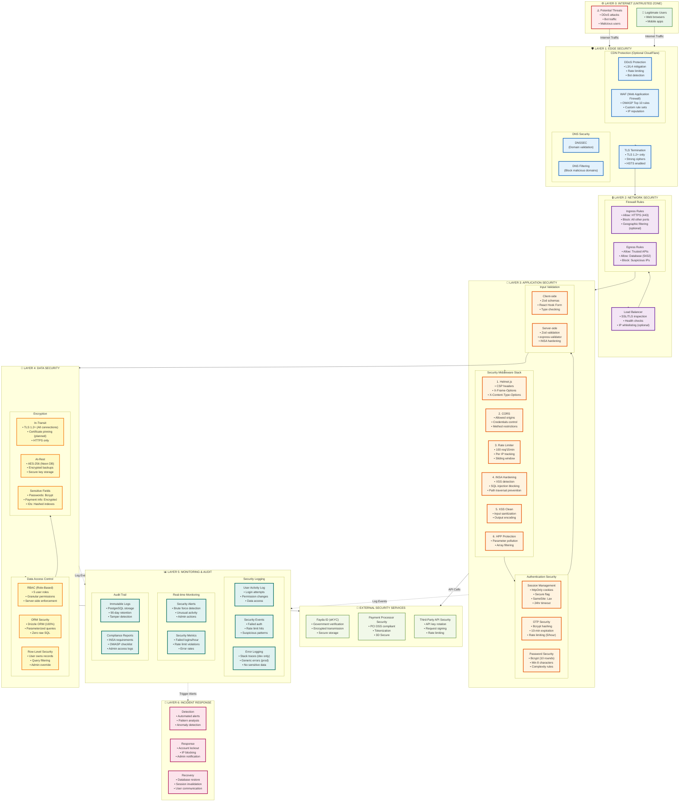

# System Architecture Diagram (Part 3/3)
## Security Layers - Defense in Depth Architecture


```mermaid
flowchart TB
    %% Layer 0: Internet (Untrusted Zone)
    subgraph L0["🌐 LAYER 0: INTERNET (UNTRUSTED ZONE)"]
        Attackers["⚠️ Potential Threats<br/>• DDoS attacks<br/>• Bot traffic<br/>• Malicious users"]
        Users["👥 Legitimate Users<br/>• Web browsers<br/>• Mobile apps"]
    end
    
    %% Layer 1: Edge Security
    subgraph L1["🛡️ LAYER 1: EDGE SECURITY"]
        direction TB
        
        subgraph DNSSecurity["DNS Security"]
            DNSSEC["DNSSEC<br/>(Domain validation)"]
            DNSFiltering["DNS Filtering<br/>(Block malicious domains)"]
        end
        
        subgraph CDNProtection["CDN Protection (Optional CloudFlare)"]
            DDoSProtection["DDoS Protection<br/>• L3/L4 mitigation<br/>• Rate limiting<br/>• Bot detection"]
            WAF["WAF (Web Application Firewall)<br/>• OWASP Top 10 rules<br/>• Custom rule sets<br/>• IP reputation"]
        end
        
        TLSTermination["TLS Termination<br/>• TLS 1.2+ only<br/>• Strong ciphers<br/>• HSTS enabled"]
    end
    
    %% Layer 2: Network Security
    subgraph L2["🔒 LAYER 2: NETWORK SECURITY"]
        direction TB
        
        LoadBalancer["Load Balancer<br/>• SSL/TLS inspection<br/>• Health checks<br/>• IP whitelisting (optional)"]
        
        subgraph Firewall["Firewall Rules"]
            IngressRules["Ingress Rules<br/>• Allow: HTTPS (443)<br/>• Block: All other ports<br/>• Geographic filtering (optional)"]
            
            EgressRules["Egress Rules<br/>• Allow: Trusted APIs<br/>• Allow: Database (5432)<br/>• Block: Suspicious IPs"]
        end
    end
    
    %% Layer 3: Application Security
    subgraph L3["🔐 LAYER 3: APPLICATION SECURITY"]
        direction TB
        
        subgraph SecurityMiddleware["Security Middleware Stack"]
            direction LR
            
            M1["1. Helmet.js<br/>• CSP headers<br/>• X-Frame-Options<br/>• X-Content-Type-Options"]
            
            M2["2. CORS<br/>• Allowed origins<br/>• Credentials control<br/>• Method restrictions"]
            
            M3["3. Rate Limiter<br/>• 100 req/15min<br/>• Per IP tracking<br/>• Sliding window"]
            
            M4["4. INSA Hardening<br/>• XSS detection<br/>• SQL injection blocking<br/>• Path traversal prevention"]
            
            M5["5. XSS Clean<br/>• Input sanitization<br/>• Output encoding"]
            
            M6["6. HPP Protection<br/>• Parameter pollution<br/>• Array filtering"]
        end
        
        subgraph AuthSecurity["Authentication Security"]
            SessionSec["Session Management<br/>• httpOnly cookies<br/>• Secure flag<br/>• SameSite: Lax<br/>• 24hr timeout"]
            
            OTPSec["OTP Security<br/>• Bcrypt hashing<br/>• 10-min expiration<br/>• Rate limiting (5/hour)"]
            
            PasswordSec["Password Security<br/>• Bcrypt (10 rounds)<br/>• Min 8 characters<br/>• Complexity rules"]
        end
        
        subgraph InputValidation["Input Validation"]
            ClientVal["Client-side<br/>• Zod schemas<br/>• React Hook Form<br/>• Type checking"]
            
            ServerVal["Server-side<br/>• Zod validation<br/>• express-validator<br/>• INSA hardening"]
        end
    end
    
    %% Layer 4: Data Security
    subgraph L4["💾 LAYER 4: DATA SECURITY"]
        direction TB
        
        subgraph DataAccess["Data Access Control"]
            RBAC["RBAC (Role-Based)<br/>• 5 user roles<br/>• Granular permissions<br/>• Server-side enforcement"]
            
            ORMSecurity["ORM Security<br/>• Drizzle ORM (100%)<br/>• Parameterized queries<br/>• Zero raw SQL"]
            
            RowLevelSec["Row-Level Security<br/>• User owns records<br/>• Query filtering<br/>• Admin override"]
        end
        
        subgraph Encryption["Encryption"]
            InTransit["In-Transit<br/>• TLS 1.2+ (All connections)<br/>• Certificate pinning (planned)<br/>• HTTPS only"]
            
            AtRest["At-Rest<br/>• AES-256 (Neon DB)<br/>• Encrypted backups<br/>• Secure key storage"]
            
            Sensitive["Sensitive Fields<br/>• Passwords: Bcrypt<br/>• Payment info: Encrypted<br/>• IDs: Hashed indexes"]
        end
    end
    
    %% Layer 5: Monitoring & Logging
    subgraph L5["📊 LAYER 5: MONITORING & AUDIT"]
        direction TB
        
        subgraph Logging["Security Logging"]
            ActivityLog["User Activity Log<br/>• Login attempts<br/>• Permission changes<br/>• Data access"]
            
            SecurityLog["Security Events<br/>• Failed auth<br/>• Rate limit hits<br/>• Suspicious patterns"]
            
            ErrorLog["Error Logging<br/>• Stack traces (dev only)<br/>• Generic errors (prod)<br/>• No sensitive data"]
        end
        
        subgraph Monitoring["Real-time Monitoring"]
            Alerts["Security Alerts<br/>• Brute force detection<br/>• Unusual activity<br/>• Admin actions"]
            
            Metrics["Security Metrics<br/>• Failed logins/hour<br/>• Rate limit violations<br/>• Error rates"]
        end
        
        subgraph AuditTrail["Audit Trail"]
            ImmutableLog["Immutable Logs<br/>• PostgreSQL storage<br/>• 90-day retention<br/>• Tamper detection"]
            
            ComplianceReport["Compliance Reports<br/>• INSA requirements<br/>• OWASP checklist<br/>• Admin access logs"]
        end
    end
    
    %% Layer 6: Incident Response
    subgraph L6["🚨 LAYER 6: INCIDENT RESPONSE"]
        direction LR
        
        Detection["Detection<br/>• Automated alerts<br/>• Pattern analysis<br/>• Anomaly detection"]
        
        Response["Response<br/>• Account lockout<br/>• IP blocking<br/>• Admin notification"]
        
        Recovery["Recovery<br/>• Database restore<br/>• Session invalidation<br/>• User communication"]
    end
    
    %% External Security Integrations
    subgraph ExternalSec["🔗 EXTERNAL SECURITY SERVICES"]
        direction TB
        
        FaydaID["Fayda ID (eKYC)<br/>• Government verification<br/>• Encrypted transmission<br/>• Secure storage"]
        
        PaymentSecurity["Payment Processor Security<br/>• PCI DSS compliant<br/>• Tokenization<br/>• 3D Secure"]
        
        ThirdPartyAPIs["Third-Party API Security<br/>• API key rotation<br/>• Request signing<br/>• Rate limiting"]
    end
    
    %% Flow Connections
    Users & Attackers -->|"Internet Traffic"| L1
    
    L1 --> TLSTermination
    TLSTermination --> L2
    
    L2 --> LoadBalancer
    LoadBalancer --> Firewall
    Firewall --> L3
    
    L3 --> SecurityMiddleware
    SecurityMiddleware --> AuthSecurity
    AuthSecurity --> InputValidation
    InputValidation --> L4
    
    L4 --> DataAccess
    DataAccess --> Encryption
    
    L3 & L4 -.->|"Log Events"| L5
    L5 -.->|"Trigger Alerts"| L6
    
    L3 & L4 -->|"API Calls"| ExternalSec
    
    %% Styling
    classDef threatClass fill:#ffebee,stroke:#c62828,stroke-width:3px
    classDef userClass fill:#e8f5e9,stroke:#2e7d32,stroke-width:2px
    classDef edgeClass fill:#e3f2fd,stroke:#1565c0,stroke-width:3px
    classDef networkClass fill:#f3e5f5,stroke:#6a1b9a,stroke-width:3px
    classDef appClass fill:#fff3e0,stroke:#e65100,stroke-width:3px
    classDef dataClass fill:#fff9c4,stroke:#f57f17,stroke-width:3px
    classDef monitorClass fill:#e0f2f1,stroke:#00695c,stroke-width:3px
    classDef incidentClass fill:#fce4ec,stroke:#ad1457,stroke-width:3px
    classDef externalClass fill:#f1f8e9,stroke:#558b2f,stroke-width:2px
    
    class Attackers threatClass
    class Users userClass
    class DNSSEC,DNSFiltering,DDoSProtection,WAF,TLSTermination edgeClass
    class LoadBalancer,IngressRules,EgressRules networkClass
    class M1,M2,M3,M4,M5,M6,SessionSec,OTPSec,PasswordSec,ClientVal,ServerVal appClass
    class RBAC,ORMSecurity,RowLevelSec,InTransit,AtRest,Sensitive dataClass
    class ActivityLog,SecurityLog,ErrorLog,Alerts,Metrics,ImmutableLog,ComplianceReport monitorClass
    class Detection,Response,Recovery incidentClass
    class FaydaID,PaymentSecurity,ThirdPartyAPIs externalClass
```

## Security Control Details

### **LAYER 1: Edge Security (DMZ)**

**Purpose:** First line of defense against internet threats

**Technologies:**
- **TLS/SSL:** TLS 1.2+ mandatory, TLS 1.0/1.1 disabled
- **HSTS:** HTTP Strict Transport Security (max-age: 31536000)
- **WAF Rules:** OWASP ModSecurity Core Rule Set
- **DDoS Mitigation:** L3/L4/L7 protection, rate limiting at edge

**Configuration:**
```nginx
# HTTPS only (no HTTP)
ssl_protocols TLSv1.2 TLSv1.3;
ssl_ciphers HIGH:!aNULL:!MD5;
add_header Strict-Transport-Security "max-age=31536000; includeSubDomains" always;
```

---

### **LAYER 2: Network Security**

**Firewall Rules:**
```
INGRESS:
  Allow: TCP 443 (HTTPS) from 0.0.0.0/0
  Allow: TCP 22 (SSH) from admin IPs only
  Block: All other inbound traffic

EGRESS:
  Allow: TCP 443 to Payment APIs (Chapa, Stripe, PayPal)
  Allow: TCP 5432 to Neon DB (AWS US-East)
  Allow: TCP 443 to Google Cloud Storage
  Allow: TCP 443 to SendGrid, Ethiopian Telecom
  Block: All other outbound traffic
```

**VPN/Bastion (Future Enhancement):**
- Admin access via VPN (not yet implemented)
- Database access via SSH tunnel (optional)

---

### **LAYER 3: Application Security**

**OWASP Top 10 2021 Coverage:**

| Vulnerability | Protection Mechanism | Implementation |
|---------------|---------------------|----------------|
| A01: Broken Access Control | RBAC + Server-side checks | 5 roles, granular permissions |
| A02: Cryptographic Failures | TLS + Bcrypt + AES-256 | All data encrypted |
| A03: Injection | Drizzle ORM (100%) | Zero raw SQL queries |
| A04: Insecure Design | Threat modeling + INSA hardening | Security-by-design |
| A05: Security Misconfiguration | Helmet.js + INSA hardening | 14 security controls active |
| A06: Vulnerable Components | npm audit (weekly) | All packages up-to-date |
| A07: Authentication Failures | Bcrypt + Rate limiting + OTP | Multi-factor security |
| A08: Software/Data Integrity | Audit logs + Validation | Integrity checks |
| A09: Logging Failures | PostgreSQL logs | 90-day retention |
| A10: SSRF | No user-controlled URLs | Controlled external calls |

**Active Security Middleware (14 controls):**
1. ✅ Helmet.js (13 security headers)
2. ✅ CORS (origin validation)
3. ✅ Rate Limiting (100 req/15min)
4. ✅ XSS Clean (input sanitization)
5. ✅ INSA Hardening (XSS, SQL, CSRF, Path Traversal)
6. ✅ HPP Protection (parameter pollution)
7. ✅ Express Mongo Sanitize (NoSQL injection)
8. ✅ Session Security (httpOnly, secure, sameSite)
9. ✅ Bcrypt (password hashing, 10 rounds)
10. ✅ Zod Validation (type-safe schemas)
11. ✅ Express Validator (server-side validation)
12. ✅ File Upload Limits (5MB, type validation)
13. ✅ Error Sanitization (no stack traces in prod)
14. ✅ Content Security Policy (CSP headers)

---

### **LAYER 4: Data Security**

**Encryption Standards:**
- **In-Transit:** TLS 1.2+ (AES-256-GCM cipher)
- **At-Rest:** AES-256 (Neon database encryption)
- **Password Hashing:** Bcrypt (cost factor: 10)
- **Session Tokens:** SHA-256 hashed

**Data Classification:**

| Classification | Examples | Protection |
|----------------|----------|------------|
| **Critical** | Passwords, Payment info, IDs | Bcrypt/AES-256, encrypted storage |
| **Sensitive** | Phone, Email, TeleBirr account | TLS in-transit, encrypted at-rest |
| **Confidential** | Bookings, Reviews, Commission | Access control, audit logs |
| **Public** | Property listings (active) | No encryption (public data) |

**RBAC Permission Matrix:**

| Action | Guest | Host | Agent | Operator | Admin |
|--------|-------|------|-------|----------|-------|
| View public properties | ✅ | ✅ | ✅ | ✅ | ✅ |
| Book property | ✅ | ❌ | ❌ | ❌ | ✅ |
| List property | ❌ | ✅ | ❌ | ❌ | ✅ |
| Link property (agent) | ❌ | ❌ | ✅ | ❌ | ✅ |
| Verify IDs | ❌ | ❌ | ❌ | ✅ | ✅ |
| Change user roles | ❌ | ❌ | ❌ | ❌ | ✅ |
| Access all data | ❌ | ❌ | ❌ | ❌ | ✅ |

---

### **LAYER 5: Monitoring & Audit**

**Logged Events (user_activity_log table):**
- ✅ Login attempts (success & failure)
- ✅ Password changes
- ✅ Role changes (admin actions)
- ✅ Property creation/modification
- ✅ Booking creation/cancellation
- ✅ Payment transactions
- ✅ Commission calculations
- ✅ Agent verifications
- ✅ ID verification attempts
- ✅ Failed authorization attempts
- ✅ Rate limit violations
- ✅ Suspicious activity patterns

**Log Format:**
```json
{
  "timestamp": "2025-11-06T10:30:45Z",
  "userId": 123,
  "action": "login_attempt",
  "result": "success",
  "ipAddress": "196.188.xxx.xxx",
  "userAgent": "Mozilla/5.0...",
  "metadata": { "method": "otp" }
}
```

**Retention Policy:**
- Security logs: 90 days
- Audit logs: 1 year
- Payment logs: 7 years (ERCA requirement)

---

### **LAYER 6: Incident Response**

**Automated Responses:**
- **Brute Force Detection:** Lock account after 5 failed attempts (15-min lockout)
- **Rate Limit Violation:** Temporary IP block (1 hour)
- **Suspicious Pattern:** Admin alert + session termination
- **Payment Fraud:** Transaction hold + operator review

**Manual Response Procedures:**
1. **Detection:** Alert triggered in monitoring system
2. **Triage:** Admin reviews security logs
3. **Containment:** Block IP, suspend account, invalidate sessions
4. **Investigation:** Analyze logs, identify attack vector
5. **Remediation:** Patch vulnerability, update firewall rules
6. **Recovery:** Restore service, notify affected users
7. **Post-Incident:** Document lessons learned, update procedures

---

### **Ethiopian Regulatory Compliance:**

**INSA Requirements:**
- ✅ Government-grade security hardening
- ✅ 90-day security log retention
- ✅ Audit trail for all sensitive operations
- ✅ Encryption at-rest and in-transit
- ✅ Role-based access control
- ✅ Incident response procedures

**ERCA (Tax Authority):**
- ✅ 7-year payment record retention
- ✅ Tamper-proof transaction logs
- ✅ PDF invoice generation (jsPDF)

**Fayda ID Integration:**
- ✅ Secure government API communication
- ✅ Encrypted ID data storage
- ✅ Operator review workflow

---

**Document:** Security Layers  
**Created:** November 6, 2025  
**Standard:** INSA Security Architecture Requirements  
**Compliance:** OWASP Top 10, INSA Guidelines, ERCA Regulations  
**Export:** Use mermaid.live to export to PNG/PDF
