# System Architecture Diagram
## Alga Platform - Technical Infrastructure

```mermaid
flowchart TB
    subgraph Internet["🌐 INTERNET"]
        Users["👥 Users<br/>(Web & Mobile)"]
    end
    
    subgraph ReplitInfra["☁️ REPLIT CLOUD INFRASTRUCTURE"]
        subgraph SecurityLayer["🛡️ SECURITY LAYER"]
            TLS["🔒 TLS/SSL<br/>Automatic HTTPS<br/>(*.replit.dev)"]
            Firewall["🧱 Firewall<br/>Port 5000 Only<br/>All Others Blocked"]
        end
        
        subgraph AppLayer["📱 APPLICATION LAYER - Port 5000"]
            subgraph Frontend["FRONTEND (Client)"]
                React["⚛️ React 18<br/>TypeScript<br/>Vite Build"]
                PWA["📲 PWA<br/>Service Worker<br/>Offline Support"]
                Capacitor["📱 Capacitor<br/>iOS & Android<br/>Native Wrapper"]
                UI["🎨 UI Layer<br/>Shadcn/Radix UI<br/>Tailwind CSS"]
            end
            
            subgraph Middleware["MIDDLEWARE"]
                Helmet["🪖 Helmet.js<br/>Security Headers<br/>CSP, X-Frame"]
                CORS["🔗 CORS<br/>Origin Whitelist<br/>Credentials Support"]
                RateLimit["⏱️ Rate Limiter<br/>100 req/15min<br/>Per IP"]
                INSA["🛡️ INSA Hardening<br/>XSS, SQL, HPP<br/>NoSQL Protection"]
                Session["🎫 Session Manager<br/>PostgreSQL Store<br/>24hr Timeout"]
            end
            
            subgraph Backend["BACKEND (Server)"]
                Express["🚂 Express.js<br/>Node.js 20<br/>TypeScript"]
                Routes["🛤️ API Routes<br/>RESTful Endpoints<br/>40+ Routes"]
                Validation["✅ Validation<br/>Zod Schemas<br/>express-validator"]
            end
            
            subgraph BusinessLogic["BUSINESS LOGIC"]
                AuthService["🔐 Auth Service<br/>Passwordless OTP<br/>Session Management"]
                PropertyService["🏠 Property Service<br/>CRUD Operations<br/>Image Processing"]
                BookingService["📅 Booking Service<br/>Availability Check<br/>Access Codes"]
                PaymentService["💰 Alga Pay<br/>Payment Gateway<br/>Commission Calc"]
                AgentService["🤝 Agent Service<br/>Commission Track<br/>TeleBirr Payout"]
                NotificationService["📧 Notification<br/>SMS/Email<br/>OTP Delivery"]
                VerificationService["🆔 Verification<br/>OCR, QR Scan<br/>Operator Review"]
            end
            
            subgraph DataAccess["DATA ACCESS LAYER"]
                Drizzle["🗄️ Drizzle ORM<br/>Type-Safe Queries<br/>Zero Raw SQL"]
                ConnPool["🔌 Connection Pool<br/>PostgreSQL Client<br/>Auto Scaling"]
            end
        end
        
        subgraph Storage["💾 STORAGE LAYER"]
            DB["🐘 PostgreSQL<br/>(Neon Serverless)<br/>20+ Tables<br/>Auto-scaling"]
            ObjectStore["☁️ Object Storage<br/>Google Cloud<br/>(Replit Backend)<br/>Property Images"]
            SessionStore["🎫 Session Store<br/>PostgreSQL Table<br/>connect-pg-simple"]
        end
    end
    
    subgraph External["🌍 EXTERNAL SERVICES"]
        subgraph Payments["💳 PAYMENT PROCESSORS"]
            Chapa["Chapa<br/>(Ethiopian)"]
            Stripe["Stripe<br/>(International)"]
            PayPal["PayPal<br/>(International)"]
            TeleBirr["TeleBirr<br/>(Agent Payouts)"]
        end
        
        subgraph Communication["📞 COMMUNICATION"]
            SendGrid["SendGrid<br/>(Email/OTP)"]
            EthTel["Ethiopian Telecom<br/>(SMS/OTP)"]
        end
        
        subgraph Identity["🆔 IDENTITY & LOCATION"]
            Fayda["Fayda ID<br/>(eKYC)"]
            GMaps["Google Maps<br/>(Geocoding)"]
        end
        
        subgraph Govt["🏛️ GOVERNMENT"]
            ERCA["ERCA<br/>(Tax Authority)<br/>Invoice Compliance"]
        end
    end
    
    %% User to Security Flow
    Users -->|"HTTPS Requests"| TLS
    TLS -->|"Decrypt"| Firewall
    Firewall -->|"Port 5000"| Frontend
    
    %% Frontend Flow
    Frontend -->|"API Calls<br/>(Axios/Fetch)"| Middleware
    
    %% Middleware Chain
    Middleware -->|"Validated Request"| Backend
    
    %% Backend to Business Logic
    Backend --> Routes
    Routes --> Validation
    Validation --> BusinessLogic
    
    %% Business Logic to Services
    BusinessLogic --> AuthService
    BusinessLogic --> PropertyService
    BusinessLogic --> BookingService
    BusinessLogic --> PaymentService
    BusinessLogic --> AgentService
    BusinessLogic --> NotificationService
    BusinessLogic --> VerificationService
    
    %% Services to Data Access
    AuthService --> Drizzle
    PropertyService --> Drizzle
    BookingService --> Drizzle
    PaymentService --> Drizzle
    AgentService --> Drizzle
    NotificationService --> Drizzle
    VerificationService --> Drizzle
    
    %% Data Access to Storage
    Drizzle --> ConnPool
    ConnPool --> DB
    Session --> SessionStore
    PropertyService --> ObjectStore
    
    %% External Service Integrations
    PaymentService --> Chapa
    PaymentService --> Stripe
    PaymentService --> PayPal
    AgentService --> TeleBirr
    NotificationService --> SendGrid
    NotificationService --> EthTel
    VerificationService --> Fayda
    PropertyService --> GMaps
    PaymentService --> ERCA
    
    %% Styling
    classDef securityClass fill:#ffebee,stroke:#c62828,stroke-width:3px
    classDef appClass fill:#e3f2fd,stroke:#1976d2,stroke-width:2px
    classDef storageClass fill:#fff9c4,stroke:#f57f17,stroke-width:2px
    classDef externalClass fill:#f3e5f5,stroke:#7b1fa2,stroke-width:2px
    classDef userClass fill:#e8f5e9,stroke:#388e3c,stroke-width:2px
    
    class TLS,Firewall,Helmet,CORS,RateLimit,INSA securityClass
    class Frontend,Backend,Middleware,BusinessLogic,DataAccess appClass
    class DB,ObjectStore,SessionStore storageClass
    class Payments,Communication,Identity,Govt externalClass
    class Users userClass
```



## Infrastructure Components

### 🌐 Internet Layer
**User Access Points:**
- Web browsers (Chrome, Safari, Firefox, Edge)
- Progressive Web App (PWA)
- Native mobile apps (iOS via Capacitor)
- Native mobile apps (Android via Capacitor)

**Traffic:** All HTTPS, TLS 1.2+ enforced

---

### 🛡️ Security Layer

#### TLS/SSL Termination
- **Provider:** Replit Proxy (automatic)
- **Certificate:** Wildcard cert for `*.replit.dev`
- **Protocol:** TLS 1.2, TLS 1.3
- **Ciphers:** Strong cipher suites only
- **HSTS:** Enabled in production (max-age: 1 year)

#### Firewall
- **Exposed Port:** 5000 only
- **Blocked:** All other ports (3000, 8080, etc.)
- **DDoS Protection:** Replit infrastructure-level
- **Rate Limiting:** Application-level (express-rate-limit)

---

### 📱 Application Layer (Port 5000)

#### Frontend Stack
| Component | Technology | Purpose |
|-----------|-----------|---------|
| Framework | React 18 + TypeScript | UI rendering, type safety |
| Build Tool | Vite | Fast dev server, optimized builds |
| Routing | Wouter | Lightweight client-side routing |
| State | TanStack Query v5 | Server state caching |
| Forms | React Hook Form + Zod | Type-safe form validation |
| UI Library | Shadcn/Radix UI | Accessible component primitives |
| Styling | Tailwind CSS | Utility-first CSS |
| PWA | vite-plugin-pwa | Service worker, offline support |
| Mobile | Capacitor | Native iOS/Android wrapper |

#### Middleware Stack (Order Matters!)
1. **Helmet.js** - Security headers first
2. **CORS** - Cross-origin resource sharing
3. **Body Parser** - JSON/URL-encoded (10MB limit)
4. **Rate Limiter** - 100 requests per 15min per IP
5. **INSA Hardening** - Custom Ethiopian compliance
   - HPP protection
   - NoSQL sanitization
   - XSS detection
   - SQL injection prevention
6. **Session Manager** - PostgreSQL session store

#### Backend Stack
- **Runtime:** Node.js 20 LTS
- **Framework:** Express.js (TypeScript)
- **API Style:** RESTful
- **Validation:** Zod schemas + express-validator
- **Error Handling:** Global error middleware
- **Logging:** Request/response logging (no sensitive data)

#### Business Logic Services
1. **AuthService** - Passwordless OTP, session management
2. **PropertyService** - Listings, images, geocoding
3. **BookingService** - Reservations, access codes
4. **PaymentService** - Alga Pay abstraction, commission calc
5. **AgentService** - Commission tracking, TeleBirr payouts
6. **NotificationService** - SMS/Email via SendGrid/EthTel
7. **VerificationService** - ID docs, OCR (Tesseract.js), QR scanning

#### Data Access Layer
- **ORM:** Drizzle ORM (type-safe, zero raw SQL)
- **Migration:** Drizzle Kit (`npm run db:push`)
- **Connection:** PostgreSQL connection pool
- **Query Builder:** Drizzle's SQL builder (prevents injection)

---

### 💾 Storage Layer

#### PostgreSQL Database (Neon Serverless)
```
📊 Database: alga_production
├── 🔐 20+ Tables (users, properties, bookings, payments, etc.)
├── 🔑 Indexes on foreign keys and search fields
├── 🔒 Encryption at rest (Neon default)
├── 📈 Auto-scaling (0 to N connections)
├── 💾 Automated backups (daily, 30-day retention)
└── ⏱️ Point-in-time recovery available
```

**Critical Tables:**
- `users` - Authentication, roles, ID verification
- `properties` - Listings, images, location
- `bookings` - Reservations, access codes
- `payments` - Transactions, commissions, invoices
- `agents` - TeleBirr accounts, earnings
- `agent_commissions` - 5% commission tracking
- `sessions` - Active user sessions

#### Object Storage (Replit App Storage)
- **Backend:** Google Cloud Storage
- **Usage:** Property images (up to 10 per listing)
- **Processing:** 
  - Browser-side compression (browser-image-compression)
  - Server-side optimization (sharp)
  - WebP conversion
  - Multiple sizes (thumbnail, medium, full)
- **Security:** Signed URLs, access control

#### Session Store
- **Type:** PostgreSQL table (`sessions`)
- **Library:** connect-pg-simple
- **Expiry:** 24 hours
- **Cleanup:** Automatic via cron job

---

### 🌍 External Services

#### Payment Processors
| Service | Use Case | Integration |
|---------|----------|-------------|
| **Chapa** | Ethiopian payments (ETB) | @chapa-nodejs SDK |
| **Stripe** | International cards | @stripe/stripe-js |
| **PayPal** | International, PayPal accounts | @paypal/paypal-server-sdk |
| **TeleBirr** | Agent commission payouts | Custom API integration |

**Payment Flow:**
1. Guest selects payment method in Alga Pay
2. Alga Pay routes to appropriate processor
3. Processor handles PCI DSS compliance
4. Confirmation returned to Alga
5. Host receives 100% of booking amount
6. Agent commission (5%) queued for TeleBirr payout

#### Communication Services
| Service | Purpose | Usage |
|---------|---------|-------|
| **SendGrid** | Email delivery, OTP | @sendgrid/mail |
| **Ethiopian Telecom** | SMS delivery, OTP | Custom SMS API |

**OTP Flow:**
1. User requests OTP (phone or email)
2. 4-digit code generated
3. Sent via SMS (EthTel) or Email (SendGrid)
4. Valid for 10 minutes
5. Rate limited: 5 OTP/hour per number

#### Identity & Location
| Service | Purpose | Integration |
|---------|---------|-------------|
| **Fayda ID** | Ethiopian eKYC verification | API integration (planned) |
| **Google Maps** | Geocoding, distance calculation | Geocoding API |

#### Government Integration
| Service | Purpose | Integration |
|---------|---------|-------------|
| **ERCA** | Tax compliance, invoice validation | PDF generation (jsPDF) |

**Tax Calculation:**
- 15% VAT on platform commission
- 2% withholding tax on host earnings
- ERCA-compliant invoice PDF

---

## Network Topology

```
Internet (Any IP)
    ↓ HTTPS (443)
Replit Proxy (TLS Termination)
    ↓ HTTP
Firewall (Port 5000 Only)
    ↓
Express Server (0.0.0.0:5000)
    ↓
PostgreSQL (Internal - Neon)
    ↓
Object Storage (Internal - GCS)
```

**Security Zones:**
1. **DMZ (Demilitarized Zone):** Replit Proxy + Firewall
2. **Application Zone:** Express server, middleware
3. **Data Zone:** PostgreSQL, Object Storage
4. **External Zone:** Payment processors, APIs

---

## Deployment Architecture

### Development Environment
```
Local/Replit Dev
├── Vite Dev Server (Hot Module Reload)
├── Express Server (tsx watch mode)
├── PostgreSQL (Neon Development DB)
└── Environment: NODE_ENV=development
```

### Production Environment (Future)
```
Replit Deployment
├── Static Files (Vite build output)
├── Express Server (Production mode)
├── PostgreSQL (Neon Production DB)
├── CDN (Static assets)
├── Load Balancer (Horizontal scaling)
└── Environment: NODE_ENV=production
```

---

## Security Architecture

### Defense in Depth (7 Layers)
1. **Network:** Firewall, TLS/SSL, HSTS
2. **Application:** Helmet, CORS, CSP, INSA hardening
3. **Authentication:** OTP, session tokens, Bcrypt
4. **Authorization:** RBAC (5 roles), route guards
5. **Data:** Drizzle ORM, input validation, sanitization
6. **Monitoring:** Audit logs, security event logging
7. **Compliance:** OWASP Top 10, INSA requirements

### Security Controls
| Control | Technology | Status |
|---------|-----------|--------|
| TLS/SSL | Replit Proxy | ✅ Active |
| Firewall | Replit Infrastructure | ✅ Active |
| Security Headers | Helmet.js | ✅ Active |
| CORS | cors middleware | ✅ Active |
| Rate Limiting | express-rate-limit | ✅ Active |
| XSS Protection | xss-clean, CSP | ✅ Active |
| SQL Injection | Drizzle ORM | ✅ Active |
| NoSQL Injection | express-mongo-sanitize | ✅ Active |
| HPP | hpp middleware | ✅ Active |
| CSRF | SameSite cookies | ✅ Active |
| Session Security | PostgreSQL store | ✅ Active |
| Input Validation | Zod, express-validator | ✅ Active |
| Error Handling | Global middleware | ✅ Active |
| Audit Logging | Custom logger | ✅ Active |

---

## Scalability & Performance

### Horizontal Scaling (Future)
- Stateless application design (sessions in PostgreSQL)
- Load balancer distribution
- Multiple Express instances
- Shared PostgreSQL + Object Storage

### Vertical Scaling
- Neon PostgreSQL auto-scaling (0 to N connections)
- Node.js cluster mode (multi-core utilization)
- Connection pooling

### Caching Strategy
- **Frontend:** TanStack Query caching, browser cache
- **API:** Memoization (memoizee library)
- **Database:** PostgreSQL query planner optimization
- **Static Assets:** CDN (future)

### Performance Targets
- API Response: <200ms (p95)
- Page Load: <2 seconds (3G network)
- Database Query: <100ms (indexed queries)
- Image Load: Progressive, lazy-loaded

---

**Document:** System Architecture Diagram  
**Created:** November 6, 2025  
**Standard:** INSA OF/AEAD/001  
**Export:** Use mermaid.live or GitHub to export to PNG/SVG  
**Version:** 1.0
