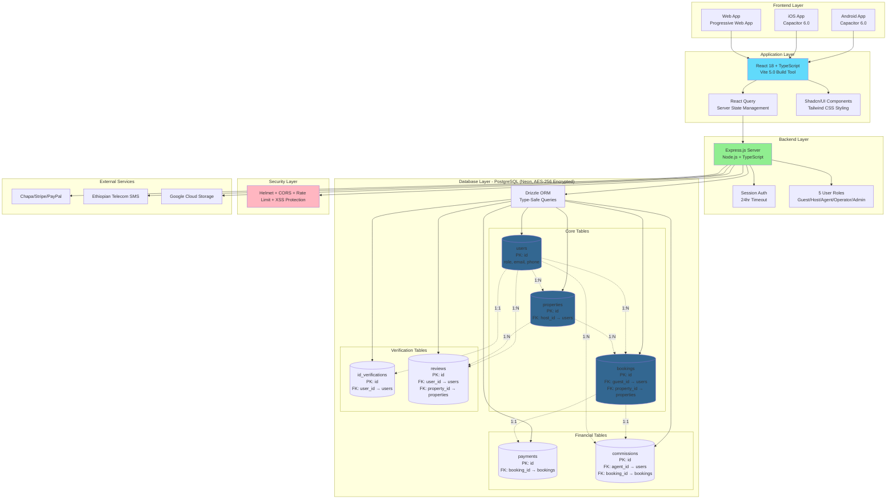

# INSA Mobile App Submission - 3 Essential Diagrams (A4 Size)

## Diagram 1: Business Architecture (Simplified)


---

## Diagram 2: Data Flow (Simplified)


**Data Encryption:**
- **In Transit:** TLS 1.2+ (all connections)
- **At Rest:** AES-256 (database + files)
- **Passwords:** Bcrypt hash (cost 12, one-way)

---

## Diagram 3: System Architecture with Database Relationships



**Database Relationships:**

| Relationship | Type | Description |
|--------------|------|-------------|
| users → properties | 1:N | One host owns many properties |
| users → bookings | 1:N | One guest makes many bookings |
| properties → bookings | 1:N | One property has many bookings |
| bookings → payments | 1:1 | One booking has one payment |
| bookings → commissions | 1:1 | One booking generates one commission |
| users → commissions | 1:N | One agent earns many commissions |
| users → id_verifications | 1:1 | One user has one ID verification |
| users → reviews | 1:N | One user writes many reviews |
| properties → reviews | 1:N | One property receives many reviews |

**Technology Stack Summary:**

| Layer | Technology | Purpose |
|-------|-----------|---------|
| **Mobile** | Capacitor 6.0 | Native Android/iOS wrapper |
| **Frontend** | React 18 + TypeScript | UI components |
| **Routing** | Wouter | Client-side navigation |
| **Styling** | Tailwind + Shadcn/UI | Responsive design |
| **Backend** | Express.js + Node.js | REST API server |
| **Database** | PostgreSQL (Neon) | Encrypted data storage |
| **ORM** | Drizzle ORM | Type-safe SQL queries |
| **Auth** | Session + OTP | Passwordless login |
| **Security** | Helmet + CORS + Rate Limit | OWASP protection |
| **Payments** | Chapa + Stripe + PayPal | Multi-processor gateway |

---

## How to Export as A4 PDF

### **Method 1: Mermaid Live (Easiest)**

1. **Go to:** https://mermaid.live/
2. **Copy** one diagram above (everything inside the ```mermaid block)
3. **Paste** into Mermaid Live editor
4. **Click:** "Download SVG"
5. **Open SVG** in Mac Preview
6. **Export as PDF:**
   - File → Export as PDF
   - Paper Size: **A4**
   - Click Save
7. **Repeat** for all 3 diagrams

### **Method 2: Print from Browser**

1. **Copy this entire markdown file** content
2. **Paste** into: https://markdownlivepreview.com/
3. **Press** Command + P (Mac) or Ctrl + P (Windows)
4. **Set:**
   - Destination: Save as PDF
   - Paper Size: A4
   - Margins: Default
5. **Save** as: `INSA_Diagrams_A4.pdf`

---

## Files You'll Submit to INSA

✅ **3 Diagrams (A4 PDFs):**
1. `Business-Architecture.pdf`
2. `Data-Flow.pdf`
3. `System-Architecture.pdf`

✅ **Or Combined:** `INSA_Alga_Diagrams.pdf` (3 pages)

---

**Document Version:** 1.0  
**Created:** January 11, 2025  
**For:** INSA Mobile App Security Audit  
**Company:** Alga One Member PLC (TIN: 0101809194)
