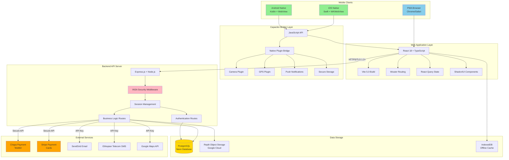
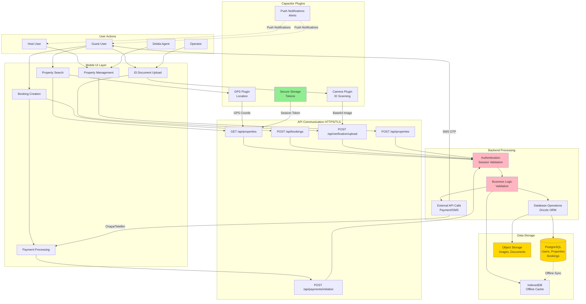
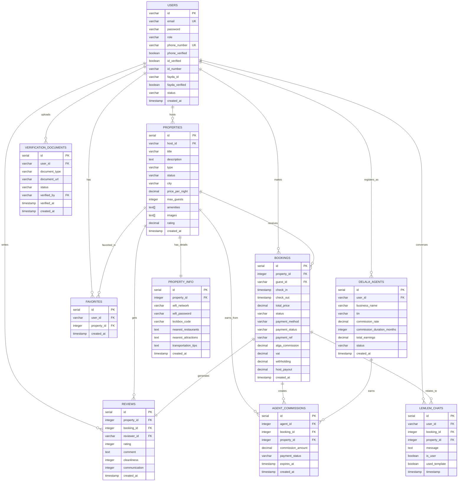
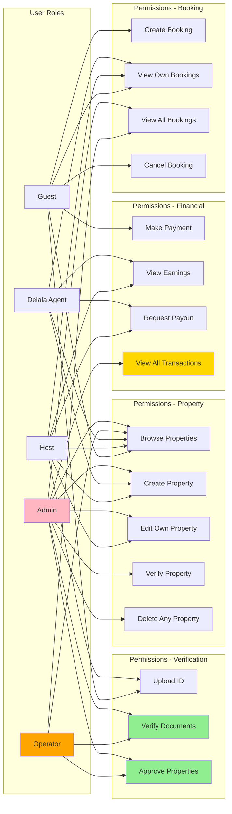
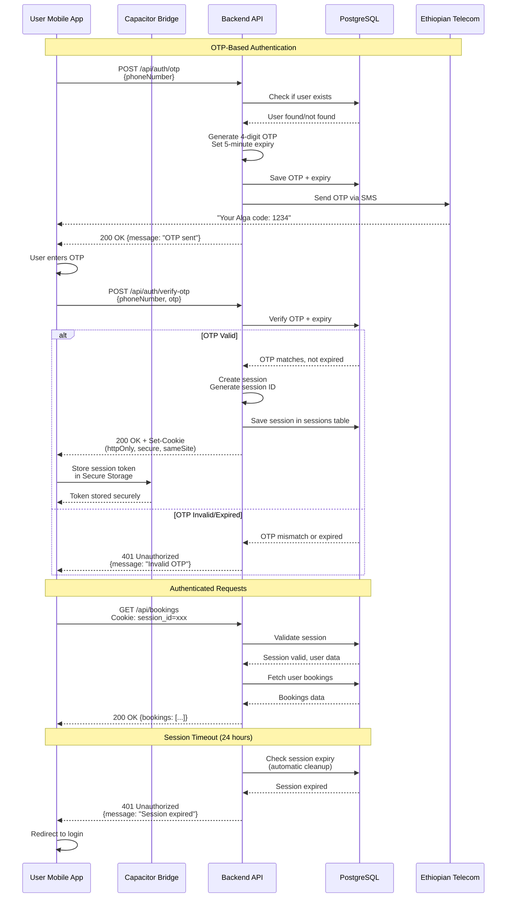
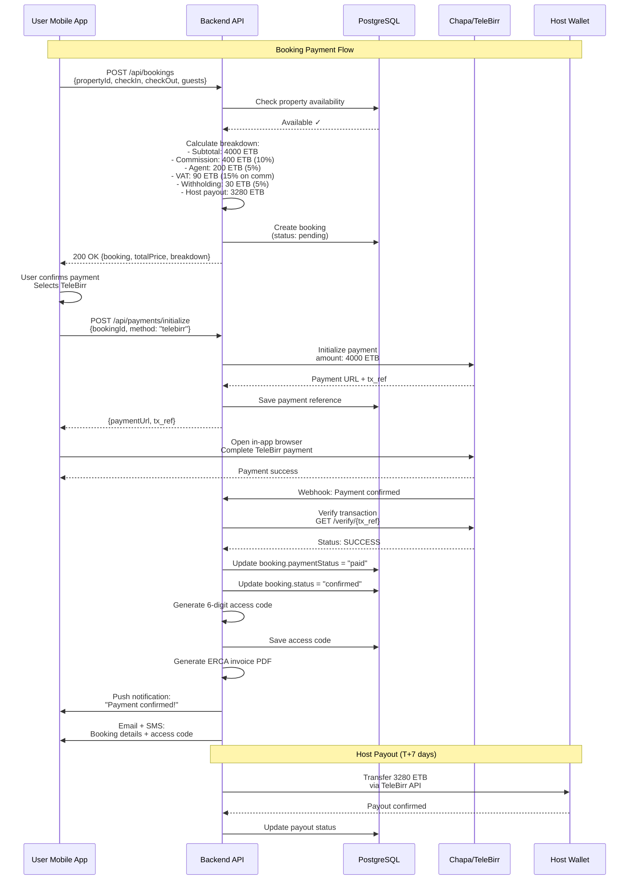
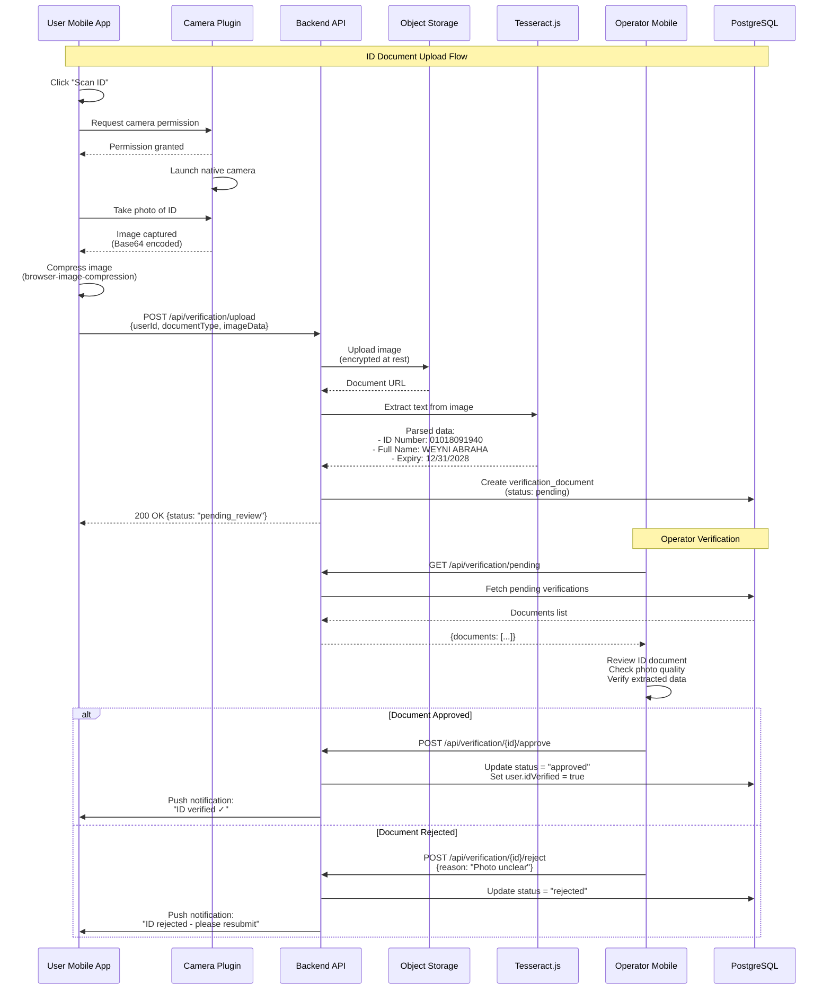

# INSA Mobile Application Security Audit - Technical Diagrams

## 1. Mobile Application Architecture Diagram

## 2. Data Flow Diagram - Mobile Application

## 3. Database Entity Relationship Diagram

## 4. User Role & Permission Matrix

## 5. Authentication & Session Flow

## 6. Payment Processing Flow (Mobile)

## 7. ID Verification Workflow (Camera Integration)

## 8. OWASP Mobile Top 10 Threat Model

```mermaid
graph TD
    subgraph "OWASP Mobile Top 10"
        M1[M1: Improper Platform Usage]
        M2[M2: Insecure Data Storage]
        M3[M3: Insecure Communication]
        M4[M4: Insecure Authentication]
        M5[M5: Insufficient Cryptography]
        M6[M6: Insecure Authorization]
        M7[M7: Client Code Quality]
        M8[M8: Code Tampering]
        M9[M9: Reverse Engineering]
        M10[M10: Extraneous Functionality]
    end
    
    subgraph "Alga Security Controls"
        C1[Capacitor Best Practices]
        C2[Encrypted Secure Storage<br/>SQLCipher Planned]
        C3[TLS 1.2+ Enforcement<br/>Certificate Pinning Planned]
        C4[Session-Based Auth<br/>OTP + Bcrypt]
        C5[Bcrypt Hashing<br/>TLS Encryption]
        C6[RBAC Server-Side<br/>Least Privilege]
        C7[TypeScript Type Safety<br/>Zod Validation]
        C8[ProGuard Obfuscation<br/>Root Detection Planned]
        C9[Code Obfuscation<br/>Server-Side Logic]
        C10[Production Build<br/>No Debug Code]
    end
    
    subgraph "Risk Status"
        R1[✅ Mitigated]
        R2[⚠️ Partial - SQLCipher Pending]
        R3[⚠️ Partial - Cert Pinning Pending]
        R4[✅ Mitigated]
        R5[✅ Mitigated]
        R6[✅ Mitigated]
        R7[✅ Mitigated]
        R8[⚠️ Partial - Root Detection Pending]
        R9[⚠️ Partial - Obfuscation Only]
        R10[✅ Mitigated]
    end
    
    M1 --> C1 --> R1
    M2 --> C2 --> R2
    M3 --> C3 --> R3
    M4 --> C4 --> R4
    M5 --> C5 --> R5
    M6 --> C6 --> R6
    M7 --> C7 --> R7
    M8 --> C8 --> R8
    M9 --> C9 --> R9
    M10 --> C10 --> R10
    
    style R1 fill:#90EE90
    style R2 fill:#FFD700
    style R3 fill:#FFD700
    style R4 fill:#90EE90
    style R5 fill:#90EE90
    style R6 fill:#90EE90
    style R7 fill:#90EE90
    style R8 fill:#FFD700
    style R9 fill:#FFD700
    style R10 fill:#90EE90
```

## 9. Offline-First Architecture (PWA + Capacitor)

```mermaid
graph TB
    subgraph "Online State"
        O1[User Request]
        O2[Network First Strategy]
        O3[Backend API]
        O4[Update IndexedDB Cache]
        O5[Display Fresh Data]
    end
    
    subgraph "Offline State"
        F1[User Request]
        F2[Check IndexedDB]
        F3[Cached Data Available?]
        F4[Display Cached Data]
        F5[Show Offline Indicator]
        F6[Queue Action for Sync]
    end
    
    subgraph "Background Sync"
        S1[Network Restored]
        S2[Service Worker Sync Event]
        S3[Process Queued Actions]
        S4[Update Backend API]
        S5[Refresh Cache]
    end
    
    O1 --> O2
    O2 --> O3
    O3 --> O4
    O4 --> O5
    
    F1 --> F2
    F2 --> F3
    F3 -->|Yes| F4
    F3 -->|No| F5
    F4 --> F6
    
    S1 --> S2
    S2 --> S3
    S3 --> S4
    S4 --> S5
    
    style O3 fill:#90EE90
    style F4 fill:#FFD700
    style S4 fill:#87CEEB
```

## 10. Security Layers - Defense in Depth

```mermaid
graph TD
    subgraph "Layer 1: Application Security"
        L1A[INSA Security Hardening]
        L1B[Helmet.js HTTP Headers]
        L1C[CORS Protection]
        L1D[Rate Limiting]
        L1E[XSS Protection]
        L1F[SQL Injection Prevention]
    end
    
    subgraph "Layer 2: Authentication"
        L2A[Session-Based Auth]
        L2B[OTP Verification]
        L2C[Bcrypt Password Hashing]
        L2D[24-Hour Session Timeout]
        L2E[Biometric Auth Planned]
    end
    
    subgraph "Layer 3: Network Security"
        L3A[TLS 1.2+ Enforcement]
        L3B[Certificate Validation]
        L3C[Certificate Pinning Planned]
        L3D[No HTTP Traffic]
        L3E[Secure WebSocket WSS]
    end
    
    subgraph "Layer 4: Data Protection"
        L4A[PostgreSQL Encryption at Rest]
        L4B[Encrypted Secure Storage]
        L4C[SQLCipher Planned]
        L4D[Object Storage Encryption]
    end
    
    subgraph "Layer 5: Authorization"
        L5A[Role-Based Access Control]
        L5B[Server-Side Validation]
        L5C[Least Privilege Principle]
    end
    
    subgraph "Layer 6: Code Protection"
        L6A[ProGuard Obfuscation Android]
        L6B[Swift Obfuscation iOS]
        L6C[Root/Jailbreak Detection Planned]
        L6D[No Hardcoded Secrets]
    end
    
    User[User Mobile App] --> L1A
    L1A --> L1B
    L1B --> L1C
    L1C --> L1D
    L1D --> L1E
    L1E --> L1F
    
    L1F --> L2A
    L2A --> L2B
    L2B --> L2C
    L2C --> L2D
    L2D --> L2E
    
    L2E --> L3A
    L3A --> L3B
    L3B --> L3C
    L3C --> L3D
    L3D --> L3E
    
    L3E --> L4A
    L4A --> L4B
    L4B --> L4C
    L4C --> L4D
    
    L4D --> L5A
    L5A --> L5B
    L5B --> L5C
    
    L5C --> L6A
    L6A --> L6B
    L6B --> L6C
    L6C --> L6D
    
    L6D --> Backend[Backend API - Protected]
    
    style L1A fill:#FFB6C1
    style L3A fill:#90EE90
    style L4A fill:#FFD700
    style L5A fill:#87CEEB
    style Backend fill:#98FB98
```

---

## How to Use These Diagrams

1. **Copy the Mermaid code** from each section
2. **Paste into:**
   - GitHub Markdown (renders automatically)
   - Mermaid Live Editor: https://mermaid.live
   - VS Code with Mermaid extension
   - Replit markdown preview

3. **For INSA Submission:**
   - Export diagrams as PNG/SVG from Mermaid Live Editor
   - Include in final PDF submission document
   - Reference diagram numbers in text (e.g., "See Diagram 2: Data Flow")

---

**Document Status:** ✅ Complete - 10 Comprehensive Diagrams  
**Format:** Mermaid.js (Markdown-compatible)  
**Purpose:** INSA Mobile Application Security Testing Requirements  
**Date:** January 11, 2025
